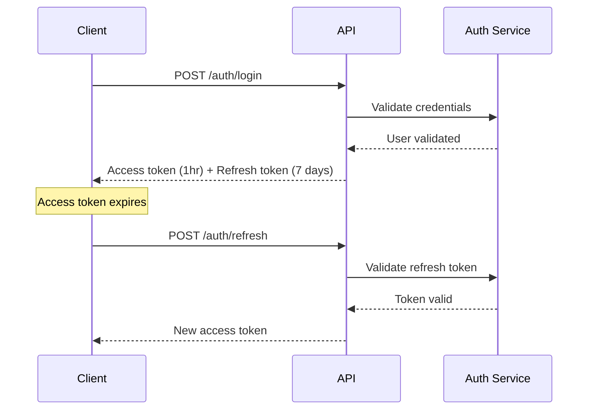

# 🚀 Expense Tracker API Documentation

## Table of Contents
- [Overview](#overview)
- [Base URL & Versioning](#base-url--versioning)
- [Authentication](#authentication)
- [Request & Response Format](#request--response-format)
- [Error Handling](#error-handling)
- [Rate Limiting](#rate-limiting)
- [Pagination](#pagination)
- [Filtering & Sorting](#filtering--sorting)
- [API Endpoints](#api-endpoints)
  - [Authentication API](#authentication-api)
  - [User Management API](#user-management-api)
  - [Expense API](#expense-api)
  - [Group API](#group-api)
  - [Payment API](#payment-api)
  - [Analytics API](#analytics-api)
  - [Notification API](#notification-api)
- [Webhooks](#webhooks)
- [WebSocket Events](#websocket-events)

---

## Overview

The Expense Tracker API is a RESTful service that provides comprehensive expense management, bill splitting, and payment tracking functionality. The API follows REST principles and returns JSON responses.

### Key Features
- JWT-based authentication
- Consistent error handling
- Rate limiting per user/IP
- Pagination on all list endpoints
- Advanced filtering and sorting
- Real-time updates via WebSockets
- Webhook support for payment events

---

## Base URL & Versioning

### Base URLs
```
Development: http://localhost:8000/api/
Staging:     https://staging-api.expensetracker.com/api/
Production:  https://api.expensetracker.com/api/
```

### API Versioning
The API uses header-based versioning:
```http
Accept: application/vnd.expensetracker.v1+json
```

---

## Authentication

### JWT Authentication

The API uses JWT (JSON Web Tokens) for authentication. Include the access token in the Authorization header:

```http
Authorization: Bearer <access_token>
```

### Token Lifecycle



---

## Request & Response Format

### Standard Request Headers
```http
Content-Type: application/json
Authorization: Bearer <token>
Accept: application/json
X-Request-ID: <unique-request-id>
```

### Standard Response Structure

#### Success Response
```json
{
  "status": "success",
  "data": {
    // Response data
  },
  "meta": {
    "timestamp": "2024-01-15T10:30:00Z",
    "request_id": "req_abc123",
    "version": "1.0"
  }
}
```

#### Error Response
```json
{
  "status": "error",
  "error": {
    "code": "ERROR_CODE",
    "message": "Human-readable error message",
    "details": [
      {
        "field": "amount",
        "message": "Must be greater than 0",
        "code": "INVALID_VALUE"
      }
    ]
  },
  "meta": {
    "timestamp": "2024-01-15T10:30:00Z",
    "request_id": "req_abc123"
  }
}
```

---

## Error Handling

### HTTP Status Codes

| Status Code | Description |
|-------------|-------------|
| 200 | OK - Request succeeded |
| 201 | Created - Resource created successfully |
| 204 | No Content - Request succeeded with no response body |
| 400 | Bad Request - Invalid request data |
| 401 | Unauthorized - Authentication required |
| 403 | Forbidden - Access denied |
| 404 | Not Found - Resource not found |
| 409 | Conflict - Resource conflict |
| 422 | Unprocessable Entity - Validation error |
| 429 | Too Many Requests - Rate limit exceeded |
| 500 | Internal Server Error - Server error |
| 503 | Service Unavailable - Service temporarily unavailable |

### Error Codes

| Error Code | Description |
|------------|-------------|
| `AUTH_REQUIRED` | Authentication is required |
| `INVALID_TOKEN` | Invalid or expired token |
| `PERMISSION_DENIED` | Insufficient permissions |
| `RESOURCE_NOT_FOUND` | Requested resource not found |
| `VALIDATION_ERROR` | Request validation failed |
| `DUPLICATE_RESOURCE` | Resource already exists |
| `RATE_LIMIT_EXCEEDED` | Too many requests |
| `PAYMENT_FAILED` | Payment processing failed |
| `INSUFFICIENT_FUNDS` | Insufficient funds for operation |

---

## Rate Limiting

### Rate Limit Headers
```http
X-RateLimit-Limit: 1000
X-RateLimit-Remaining: 999
X-RateLimit-Reset: 1642248000
```

### Rate Limits

| Endpoint Type | Anonymous | Authenticated | Premium |
|---------------|-----------|---------------|---------|
| Auth endpoints | 5/min | 10/min | 20/min |
| Read endpoints | 100/hour | 1000/hour | 5000/hour |
| Write endpoints | 50/hour | 500/hour | 2000/hour |
| Analytics | N/A | 100/hour | 1000/hour |

---

## Pagination

### Pagination Parameters

| Parameter | Type | Default | Description |
|-----------|------|---------|-------------|
| `page` | integer | 1 | Page number |
| `page_size` | integer | 20 | Items per page (max: 100) |

### Pagination Response
```json
{
  "data": [...],
  "meta": {
    "pagination": {
      "page": 1,
      "page_size": 20,
      "total_pages": 5,
      "total_items": 95,
      "has_next": true,
      "has_previous": false
    }
  },
  "links": {
    "first": "/api/expenses?page=1",
    "last": "/api/expenses?page=5",
    "next": "/api/expenses?page=2",
    "previous": null
  }
}
```

---

## Filtering & Sorting

### Filtering
Use query parameters for filtering:
```
GET /api/expenses?category=food&amount_gt=50&date_range=2024-01-01,2024-01-31
```

### Sorting
Use `sort` parameter with field names. Prefix with `-` for descending order:
```
GET /api/expenses?sort=-amount,expense_date
```

### Search
Use `search` parameter for text search:
```
GET /api/expenses?search=restaurant
```

---

## API Endpoints

## Authentication API

### 1. User Registration
**POST** `/auth/register/`

Register a new user account.

#### Request Body
```json
{
  "email": "user@example.com",
  "password": "SecurePassword123!",
  "first_name": "John",
  "last_name": "Doe",
  "username": "johndoe",
  "preferred_currency": "USD",
  "timezone": "America/New_York"
}
```

#### Response (201 Created)
```json
{
  "status": "success",
  "data": {
    "user": {
      "id": "usr_abc123",
      "email": "user@example.com",
      "username": "johndoe",
      "first_name": "John",
      "last_name": "Doe",
      "is_verified": false,
      "created_at": "2024-01-15T10:30:00Z"
    },
    "tokens": {
      "access": "eyJ0eXAiOiJKV1QiLCJhbGc...",
      "refresh": "eyJ0eXAiOiJKV1QiLCJhbGc..."
    }
  },
  "message": "Registration successful. Please verify your email."
}
```

### 2. User Login
**POST** `/auth/login/`

Authenticate user and receive tokens.

#### Request Body
```json
{
  "email": "user@example.com",
  "password": "SecurePassword123!"
}
```

#### Response (200 OK)
```json
{
  "status": "success",
  "data": {
    "user": {
      "id": "usr_abc123",
      "email": "user@example.com",
      "username": "johndoe",
      "first_name": "John",
      "last_name": "Doe"
    },
    "tokens": {
      "access": "eyJ0eXAiOiJKV1QiLCJhbGc...",
      "refresh": "eyJ0eXAiOiJKV1QiLCJhbGc...",
      "expires_in": 3600
    }
  }
}
```

### 3. Token Refresh
**POST** `/auth/refresh/`

Refresh expired access token.

#### Request Body
```json
{
  "refresh": "eyJ0eXAiOiJKV1QiLCJhbGc..."
}
```

#### Response (200 OK)
```json
{
  "status": "success",
  "data": {
    "access": "eyJ0eXAiOiJKV1QiLCJhbGc...",
    "expires_in": 3600
  }
}
```

### 4. Logout
**POST** `/auth/logout/`

Invalidate refresh token.

#### Request Body
```json
{
  "refresh": "eyJ0eXAiOiJKV1QiLCJhbGc..."
}
```

#### Response (204 No Content)
```
No content
```

### 5. Password Reset Request
**POST** `/auth/password-reset/`

Request password reset email.

#### Request Body
```json
{
  "email": "user@example.com"
}
```

#### Response (200 OK)
```json
{
  "status": "success",
  "message": "Password reset email sent if account exists"
}
```

### 6. Password Reset Confirm
**POST** `/auth/password-reset/confirm/`

Reset password with token.

#### Request Body
```json
{
  "token": "reset_token_here",
  "new_password": "NewSecurePassword123!"
}
```

#### Response (200 OK)
```json
{
  "status": "success",
  "message": "Password reset successful"
}
```

---

## User Management API

### 1. Get Current User Profile
**GET** `/users/me/`

Get authenticated user's profile.

#### Response (200 OK)
```json
{
  "status": "success",
  "data": {
    "id": "usr_abc123",
    "email": "user@example.com",
    "username": "johndoe",
    "first_name": "John",
    "last_name": "Doe",
    "avatar": "https://storage.example.com/avatars/usr_abc123.jpg",
    "bio": "Software developer and travel enthusiast",
    "preferred_currency": "USD",
    "timezone": "America/New_York",
    "profile": {
      "occupation": "Software Developer",
      "company": "Tech Corp",
      "country": "United States",
      "city": "New York",
      "total_expenses": "5432.10",
      "expense_count": 234,
      "group_count": 5
    },
    "settings": {
      "notifications_enabled": true,
      "email_notifications": true,
      "push_notifications": false
    }
  }
}
```

### 2. Update User Profile
**PATCH** `/users/me/`

Update current user's profile.

#### Request Body
```json
{
  "first_name": "John",
  "last_name": "Smith",
  "bio": "Updated bio",
  "preferred_currency": "EUR",
  "profile": {
    "occupation": "Senior Developer",
    "city": "Boston"
  }
}
```

#### Response (200 OK)
```json
{
  "status": "success",
  "data": {
    // Updated user object
  }
}
```

### 3. Upload Avatar
**POST** `/users/me/avatar/`

Upload user avatar image.

#### Request
```
Content-Type: multipart/form-data

avatar: <image file>
```

#### Response (200 OK)
```json
{
  "status": "success",
  "data": {
    "avatar_url": "https://storage.example.com/avatars/usr_abc123.jpg"
  }
}
```

---

## Expense API

### 1. List Expenses
**GET** `/expenses/`

Get list of expenses with filtering and pagination.

#### Query Parameters
| Parameter | Type | Description |
|-----------|------|-------------|
| `group_id` | string | Filter by group |
| `category_id` | string | Filter by category |
| `paid_by` | string | Filter by payer user ID |
| `date_from` | date | Start date (YYYY-MM-DD) |
| `date_to` | date | End date (YYYY-MM-DD) |
| `amount_min` | decimal | Minimum amount |
| `amount_max` | decimal | Maximum amount |
| `is_settled` | boolean | Settlement status |
| `search` | string | Search in title/description |
| `sort` | string | Sort field(s) |
| `page` | integer | Page number |
| `page_size` | integer | Items per page |

#### Response (200 OK)
```json
{
  "status": "success",
  "data": [
    {
      "id": "exp_xyz789",
      "title": "Dinner at Italian Restaurant",
      "description": "Team dinner after project completion",
      "amount": "250.00",
      "currency": {
        "code": "USD",
        "symbol": "$"
      },
      "category": {
        "id": "cat_food123",
        "name": "Food & Dining",
        "icon": "restaurant",
        "color": "#FF6B6B"
      },
      "expense_type": "group",
      "group": {
        "id": "grp_abc123",
        "name": "Project Team"
      },
      "paid_by": {
        "id": "usr_abc123",
        "name": "John Doe",
        "avatar": "https://..."
      },
      "expense_date": "2024-01-14",
      "split_type": "equal",
      "participants": [
        {
          "user_id": "usr_abc123",
          "name": "John Doe",
          "share": "62.50",
          "is_settled": false
        },
        {
          "user_id": "usr_def456",
          "name": "Jane Smith",
          "share": "62.50",
          "is_settled": true
        }
      ],
      "receipt": "https://storage.example.com/receipts/exp_xyz789.jpg",
      "tags": ["dinner", "team-event"],
      "is_settled": false,
      "created_at": "2024-01-14T19:30:00Z",
      "updated_at": "2024-01-14T19:30:00Z"
    }
  ],
  "meta": {
    "pagination": {
      "page": 1,
      "page_size": 20,
      "total_pages": 5,
      "total_items": 95
    }
  }
}
```

### 2. Create Expense
**POST** `/expenses/`

Create a new expense.

#### Request Body
```json
{
  "title": "Dinner at Italian Restaurant",
  "description": "Team dinner after project completion",
  "amount": "250.00",
  "currency": "USD",
  "category_id": "cat_food123",
  "expense_type": "group",
  "group_id": "grp_abc123",
  "expense_date": "2024-01-14",
  "split_type": "equal",
  "split_data": {
    "participants": ["usr_abc123", "usr_def456", "usr_ghi789", "usr_jkl012"]
  },
  "tags": ["dinner", "team-event"],
  "vendor": "Luigi's Restaurant",
  "location": "123 Main St, New York"
}
```

#### Response (201 Created)
```json
{
  "status": "success",
  "data": {
    "id": "exp_xyz789",
    "title": "Dinner at Italian Restaurant",
    // ... full expense object
  },
  "message": "Expense created successfully"
}
```

### 3. Get Expense Details
**GET** `/expenses/{expense_id}/`

Get detailed information about a specific expense.

#### Response (200 OK)
```json
{
  "status": "success",
  "data": {
    "id": "exp_xyz789",
    "title": "Dinner at Italian Restaurant",
    "description": "Team dinner after project completion",
    "amount": "250.00",
    "currency": {
      "code": "USD",
      "symbol": "$",
      "exchange_rate_to_usd": "1.00"
    },
    "category": {
      "id": "cat_food123",
      "name": "Food & Dining",
      "icon": "restaurant",
      "color": "#FF6B6B"
    },
    "shares": [
      {
        "id": "shr_001",
        "user": {
          "id": "usr_abc123",
          "name": "John Doe",
          "avatar": "https://..."
        },
        "amount": "62.50",
        "is_settled": false,
        "settled_at": null
      }
    ],
    "comments": [
      {
        "id": "cmt_001",
        "user": {
          "id": "usr_def456",
          "name": "Jane Smith"
        },
        "comment": "Thanks for covering this!",
        "created_at": "2024-01-14T20:00:00Z"
      }
    ],
    "activity": [
      {
        "type": "created",
        "user": "John Doe",
        "timestamp": "2024-01-14T19:30:00Z"
      }
    ]
  }
}
```

### 4. Update Expense
**PUT** `/expenses/{expense_id}/`

Update an existing expense.

#### Request Body
```json
{
  "title": "Updated: Dinner at Luigi's",
  "amount": "260.00",
  "description": "Team dinner with dessert"
}
```

#### Response (200 OK)
```json
{
  "status": "success",
  "data": {
    // Updated expense object
  }
}
```

### 5. Delete Expense
**DELETE** `/expenses/{expense_id}/`

Soft delete an expense.

#### Response (204 No Content)
```
No content
```

### 6. Update Expense Split
**POST** `/expenses/{expense_id}/split/`

Update how an expense is split.

#### Request Body
```json
{
  "split_type": "percentage",
  "split_data": {
    "usr_abc123": 40,
    "usr_def456": 30,
    "usr_ghi789": 30
  }
}
```

#### Response (200 OK)
```json
{
  "status": "success",
  "data": {
    "shares": [
      {
        "user_id": "usr_abc123",
        "amount": "100.00",
        "percentage": 40
      },
      {
        "user_id": "usr_def456",
        "amount": "75.00",
        "percentage": 30
      },
      {
        "user_id": "usr_ghi789",
        "amount": "75.00",
        "percentage": 30
      }
    ]
  }
}
```

### 7. Add Expense Comment
**POST** `/expenses/{expense_id}/comments/`

Add a comment to an expense.

#### Request Body
```json
{
  "comment": "Thanks for covering this! I'll settle up tomorrow."
}
```

#### Response (201 Created)
```json
{
  "status": "success",
  "data": {
    "id": "cmt_002",
    "user": {
      "id": "usr_ghi789",
      "name": "Bob Wilson"
    },
    "comment": "Thanks for covering this! I'll settle up tomorrow.",
    "created_at": "2024-01-15T10:30:00Z"
  }
}
```

### 8. Upload Receipt
**POST** `/expenses/{expense_id}/receipt/`

Upload receipt image for an expense.

#### Request
```
Content-Type: multipart/form-data

receipt: <image file>
```

#### Response (200 OK)
```json
{
  "status": "success",
  "data": {
    "receipt_url": "https://storage.example.com/receipts/exp_xyz789.jpg",
    "ocr_data": {
      "vendor": "Luigi's Restaurant",
      "date": "2024-01-14",
      "total": "250.00",
      "items": [
        {
          "name": "Pizza Margherita",
          "price": "18.00"
        }
      ]
    }
  }
}
```

---

## Group API

### 1. List Groups
**GET** `/groups/`

Get list of user's groups.

#### Query Parameters
| Parameter | Type | Description |
|-----------|------|-------------|
| `is_active` | boolean | Filter by active status |
| `group_type` | string | Filter by type (personal, trip, home, etc.) |
| `search` | string | Search in name/description |

#### Response (200 OK)
```json
{
  "status": "success",
  "data": [
    {
      "id": "grp_abc123",
      "name": "Roommates",
      "description": "Shared apartment expenses",
      "group_type": "home",
      "image": "https://storage.example.com/groups/grp_abc123.jpg",
      "currency": {
        "code": "USD",
        "symbol": "$"
      },
      "member_count": 3,
      "total_expenses": "4567.89",
      "unsettled_amount": "234.56",
      "my_balance": "-45.67",
      "invite_code": "ROOM2024",
      "is_admin": true,
      "created_at": "2024-01-01T00:00:00Z"
    }
  ]
}
```

### 2. Create Group
**POST** `/groups/`

Create a new expense group.

#### Request Body
```json
{
  "name": "Europe Trip 2024",
  "description": "Summer vacation to Europe",
  "group_type": "trip",
  "currency": "EUR",
  "is_private": false,
  "initial_members": [
    "user@example.com",
    "friend@example.com"
  ]
}
```

#### Response (201 Created)
```json
{
  "status": "success",
  "data": {
    "id": "grp_xyz789",
    "name": "Europe Trip 2024",
    "description": "Summer vacation to Europe",
    "group_type": "trip",
    "currency": {
      "code": "EUR",
      "symbol": "€"
    },
    "invite_code": "EURO2024",
    "member_count": 3,
    "created_at": "2024-01-15T10:30:00Z"
  }
}
```

### 3. Get Group Details
**GET** `/groups/{group_id}/`

Get detailed group information.

#### Response (200 OK)
```json
{
  "status": "success",
  "data": {
    "id": "grp_abc123",
    "name": "Roommates",
    "description": "Shared apartment expenses",
    "group_type": "home",
    "image": "https://storage.example.com/groups/grp_abc123.jpg",
    "currency": {
      "code": "USD",
      "symbol": "$"
    },
    "invite_code": "ROOM2024",
    "settings": {
      "simplify_debts": true,
      "require_approval": false,
      "auto_reminder": true
    },
    "statistics": {
      "total_expenses": "4567.89",
      "settled_amount": "4333.33",
      "unsettled_amount": "234.56",
      "expense_count": 156,
      "active_members": 3,
      "created_at": "2024-01-01T00:00:00Z"
    }
  }
}
```

### 4. Update Group
**PATCH** `/groups/{group_id}/`

Update group details.

#### Request Body
```json
{
  "name": "Apartment 2B",
  "description": "Updated description",
  "settings": {
    "simplify_debts": false
  }
}
```

#### Response (200 OK)
```json
{
  "status": "success",
  "data": {
    // Updated group object
  }
}
```

### 5. Get Group Members
**GET** `/groups/{group_id}/members/`

Get list of group members.

#### Response (200 OK)
```json
{
  "status": "success",
  "data": [
    {
      "id": "mem_001",
      "user": {
        "id": "usr_abc123",
        "name": "John Doe",
        "email": "john@example.com",
        "avatar": "https://..."
      },
      "role": "admin",
      "status": "active",
      "joined_at": "2024-01-01T00:00:00Z",
      "invited_by": {
        "id": "usr_xyz789",
        "name": "Group Creator"
      },
      "balance": "45.67",
      "total_paid": "1234.56",
      "total_owed": "1188.89"
    }
  ]
}
```

### 6. Invite Member
**POST** `/groups/{group_id}/invite/`

Invite new member to group.

#### Request Body
```json
{
  "email": "newmember@example.com",
  "message": "Join our apartment expense group!"
}
```

#### Response (201 Created)
```json
{
  "status": "success",
  "data": {
    "invitation_id": "inv_123",
    "email": "newmember@example.com",
    "expires_at": "2024-01-22T10:30:00Z"
  }
}
```

### 7. Leave Group
**POST** `/groups/{group_id}/leave/`

Leave a group.

#### Response (200 OK)
```json
{
  "status": "success",
  "message": "Successfully left the group"
}
```

### 8. Get Group Balances
**GET** `/groups/{group_id}/balances/`

Get simplified group balances.

#### Response (200 OK)
```json
{
  "status": "success",
  "data": {
    "balances": [
      {
        "user": {
          "id": "usr_abc123",
          "name": "John Doe"
        },
        "balance": "-45.67",
        "owes": [
          {
            "to_user": {
              "id": "usr_def456",
              "name": "Jane Smith"
            },
            "amount": "45.67"
          }
        ]
      }
    ],
    "simplified_debts": [
      {
        "from": {
          "id": "usr_abc123",
          "name": "John Doe"
        },
        "to": {
          "id": "usr_def456",
          "name": "Jane Smith"
        },
        "amount": "45.67"
      }
    ]
  }
}
```

### 9. Get Group Activity
**GET** `/groups/{group_id}/activity/`

Get group activity feed.

#### Response (200 OK)
```json
{
  "status": "success",
  "data": [
    {
      "id": "act_001",
      "type": "expense_added",
      "user": {
        "id": "usr_abc123",
        "name": "John Doe"
      },
      "description": "John added 'Groceries' expense of $45.67",
      "metadata": {
        "expense_id": "exp_123",
        "amount": "45.67"
      },
      "created_at": "2024-01-15T10:30:00Z"
    }
  ]
}
```

---

## Payment API

### 1. List Payment Methods
**GET** `/payments/methods/`

Get user's payment methods.

#### Response (200 OK)
```json
{
  "status": "success",
  "data": [
    {
      "id": "pm_abc123",
      "method_type": "stripe",
      "name": "Visa ending in 4242",
      "details": {
        "brand": "Visa",
        "last4": "4242",
        "exp_month": 12,
        "exp_year": 2025
      },
      "is_default": true,
      "is_verified": true,
      "created_at": "2024-01-01T00:00:00Z"
    }
  ]
}
```

### 2. Add Payment Method
**POST** `/payments/methods/`

Add a new payment method.

#### Request Body
```json
{
  "method_type": "stripe",
  "stripe_token": "tok_visa",
  "name": "Personal Visa",
  "is_default": true
}
```

#### Response (201 Created)
```json
{
  "status": "success",
  "data": {
    "id": "pm_xyz789",
    "method_type": "stripe",
    "name": "Personal Visa",
    "details": {
      "brand": "Visa",
      "last4": "4242"
    },
    "is_default": true
  }
}
```

### 3. List Settlements
**GET** `/payments/settlements/`

Get list of settlements.

#### Query Parameters
| Parameter | Type | Description |
|-----------|------|-------------|
| `status` | string | Filter by status (pending, completed, etc.) |
| `group_id` | string | Filter by group |
| `role` | string | Filter by role (payer, payee) |

#### Response (200 OK)
```json
{
  "status": "success",
  "data": [
    {
      "id": "stl_abc123",
      "payer": {
        "id": "usr_abc123",
        "name": "John Doe"
      },
      "payee": {
        "id": "usr_def456",
        "name": "Jane Smith"
      },
      "amount": "45.67",
      "currency": {
        "code": "USD",
        "symbol": "$"
      },
      "group": {
        "id": "grp_abc123",
        "name": "Roommates"
      },
      "status": "pending",
      "method": "manual",
      "description": "Settlement for January expenses",
      "due_date": "2024-01-31",
      "created_at": "2024-01-15T10:30:00Z"
    }
  ]
}
```

### 4. Create Settlement
**POST** `/payments/settlements/`

Create a new settlement request.

#### Request Body
```json
{
  "payee_id": "usr_def456",
  "amount": "45.67",
  "currency": "USD",
  "group_id": "grp_abc123",
  "description": "Settlement for January expenses",
  "due_date": "2024-01-31"
}
```

#### Response (201 Created)
```json
{
  "status": "success",
  "data": {
    "id": "stl_xyz789",
    "status": "pending",
    // ... full settlement object
  }
}
```

### 5. Confirm Settlement
**POST** `/payments/settlements/{settlement_id}/confirm/`

Confirm a settlement as completed.

#### Request Body
```json
{
  "confirmation_type": "paid",
  "payment_method": "cash",
  "notes": "Paid in cash on Jan 15"
}
```

#### Response (200 OK)
```json
{
  "status": "success",
  "data": {
    "id": "stl_xyz789",
    "status": "completed",
    "completed_at": "2024-01-15T10:30:00Z"
  }
}
```

### 6. Process Payment
**POST** `/payments/process/`

Process an automated payment.

#### Request Body
```json
{
  "settlement_id": "stl_xyz789",
  "payment_method_id": "pm_abc123",
  "amount": "45.67",
  "currency": "USD"
}
```

#### Response (200 OK)
```json
{
  "status": "success",
  "data": {
    "payment_id": "pay_123",
    "status": "completed",
    "external_transaction_id": "ch_1234567890",
    "processed_at": "2024-01-15T10:30:00Z"
  }
}
```

---

## Analytics API

### 1. Get Expense Summary
**GET** `/analytics/summary/`

Get expense summary statistics.

#### Query Parameters
| Parameter | Type | Description |
|-----------|------|-------------|
| `period` | string | Time period (daily, weekly, monthly, yearly) |
| `date_from` | date | Start date |
| `date_to` | date | End date |
| `group_id` | string | Filter by group |

#### Response (200 OK)
```json
{
  "status": "success",
  "data": {
    "period": "monthly",
    "date_range": {
      "from": "2024-01-01",
      "to": "2024-01-31"
    },
    "summary": {
      "total_expenses": "2345.67",
      "expense_count": 45,
      "average_expense": "52.13",
      "currency": "USD"
    },
    "comparison": {
      "previous_period": {
        "total_expenses": "1890.23",
        "change_percentage": 24.1
      }
    },
    "top_categories": [
      {
        "category": "Food & Dining",
        "amount": "890.12",
        "percentage": 38,
        "count": 23
      },
      {
        "category": "Transportation",
        "amount": "456.78",
        "percentage": 19.5,
        "count": 12
      }
    ]
  }
}
```

### 2. Get Spending Trends
**GET** `/analytics/trends/`

Get spending trend analysis.

#### Query Parameters
| Parameter | Type | Description |
|-----------|------|-------------|
| `period` | string | Aggregation period |
| `date_from` | date | Start date |
| `date_to` | date | End date |
| `category_id` | string | Filter by category |

#### Response (200 OK)
```json
{
  "status": "success",
  "data": {
    "trends": [
      {
        "date": "2024-01-01",
        "amount": "234.56",
        "expense_count": 5
      },
      {
        "date": "2024-01-02",
        "amount": "123.45",
        "expense_count": 3
      }
    ],
    "statistics": {
      "average_daily": "178.90",
      "peak_day": "2024-01-15",
      "peak_amount": "456.78",
      "trend_direction": "increasing",
      "trend_percentage": 12.5
    }
  }
}
```

### 3. Get Category Breakdown
**GET** `/analytics/categories/`

Get expense breakdown by category.

#### Response (200 OK)
```json
{
  "status": "success",
  "data": {
    "categories": [
      {
        "id": "cat_food123",
        "name": "Food & Dining",
        "amount": "890.12",
        "percentage": 38,
        "expense_count": 23,
        "average_expense": "38.70",
        "subcategories": [
          {
            "name": "Restaurants",
            "amount": "567.89",
            "percentage": 63.8
          },
          {
            "name": "Groceries",
            "amount": "322.23",
            "percentage": 36.2
          }
        ]
      }
    ],
    "uncategorized": {
      "amount": "123.45",
      "percentage": 5.3,
      "expense_count": 3
    }
  }
}
```

### 4. Generate Report
**POST** `/analytics/reports/generate/`

Generate a custom report.

#### Request Body
```json
{
  "report_type": "expense_summary",
  "format": "pdf",
  "filters": {
    "date_from": "2024-01-01",
    "date_to": "2024-01-31",
    "group_ids": ["grp_abc123"],
    "category_ids": ["cat_food123", "cat_transport456"]
  },
  "options": {
    "include_charts": true,
    "include_receipts": false,
    "group_by": "category"
  }
}
```

#### Response (202 Accepted)
```json
{
  "status": "success",
  "data": {
    "report_id": "rpt_xyz789",
    "status": "processing",
    "estimated_completion": "2024-01-15T10:35:00Z"
  }
}
```

### 5. Get Report Status
**GET** `/analytics/reports/{report_id}/`

Check report generation status.

#### Response (200 OK)
```json
{
  "status": "success",
  "data": {
    "report_id": "rpt_xyz789",
    "status": "completed",
    "download_url": "https://storage.example.com/reports/rpt_xyz789.pdf",
    "expires_at": "2024-01-22T10:30:00Z",
    "file_size": 2457600,
    "generated_at": "2024-01-15T10:32:00Z"
  }
}
```

---

## Notification API

### 1. List Notifications
**GET** `/notifications/`

Get user's notifications.

#### Query Parameters
| Parameter | Type | Description |
|-----------|------|-------------|
| `is_read` | boolean | Filter by read status |
| `type` | string | Filter by notification type |
| `priority` | string | Filter by priority |

#### Response (200 OK)
```json
{
  "status": "success",
  "data": [
    {
      "id": "ntf_abc123",
      "type": "expense_added",
      "title": "New expense in Roommates",
      "message": "John added 'Groceries' expense of $45.67",
      "priority": "normal",
      "is_read": false,
      "sender": {
        "id": "usr_abc123",
        "name": "John Doe"
      },
      "metadata": {
        "expense_id": "exp_123",
        "group_id": "grp_abc123"
      },
      "action_url": "/expenses/exp_123",
      "created_at": "2024-01-15T10:30:00Z"
    }
  ],
  "meta": {
    "unread_count": 5
  }
}
```

### 2. Mark Notification as Read
**PUT** `/notifications/{notification_id}/read/`

Mark a notification as read.

#### Response (200 OK)
```json
{
  "status": "success",
  "data": {
    "id": "ntf_abc123",
    "is_read": true,
    "read_at": "2024-01-15T10:30:00Z"
  }
}
```

### 3. Mark All as Read
**POST** `/notifications/mark-all-read/`

Mark all notifications as read.

#### Response (200 OK)
```json
{
  "status": "success",
  "data": {
    "updated_count": 5
  }
}
```

### 4. Get Notification Preferences
**GET** `/notifications/preferences/`

Get notification preferences.

#### Response (200 OK)
```json
{
  "status": "success",
  "data": {
    "email_enabled": true,
    "push_enabled": false,
    "sms_enabled": false,
    "preferences": [
      {
        "type": "expense_added",
        "enabled": true,
        "channels": ["email", "in_app"],
        "frequency": "immediate"
      },
      {
        "type": "payment_due",
        "enabled": true,
        "channels": ["email", "push", "in_app"],
        "frequency": "daily"
      }
    ],
    "quiet_hours": {
      "enabled": true,
      "start": "22:00",
      "end": "08:00",
      "timezone": "America/New_York"
    }
  }
}
```

### 5. Update Notification Preferences
**PUT** `/notifications/preferences/`

Update notification preferences.

#### Request Body
```json
{
  "email_enabled": true,
  "push_enabled": true,
  "preferences": [
    {
      "type": "expense_added",
      "enabled": false
    }
  ],
  "quiet_hours": {
    "enabled": true,
    "start": "23:00",
    "end": "07:00"
  }
}
```

#### Response (200 OK)
```json
{
  "status": "success",
  "message": "Preferences updated successfully"
}
```

---

## Webhooks

### Webhook Events

The API can send webhooks for the following events:

| Event | Description |
|-------|-------------|
| `expense.created` | New expense created |
| `expense.updated` | Expense updated |
| `expense.deleted` | Expense deleted |
| `payment.completed` | Payment processed successfully |
| `payment.failed` | Payment failed |
| `settlement.created` | Settlement request created |
| `settlement.completed` | Settlement marked as complete |
| `group.member_joined` | New member joined group |
| `group.member_left` | Member left group |

### Webhook Payload Format

```json
{
  "event": "expense.created",
  "timestamp": "2024-01-15T10:30:00Z",
  "data": {
    // Event-specific data
  },
  "metadata": {
    "webhook_id": "wh_abc123",
    "api_version": "1.0"
  }
}
```

### Webhook Security

Webhooks are signed using HMAC-SHA256. Verify the signature:

```python
import hmac
import hashlib

def verify_webhook(payload, signature, secret):
    expected = hmac.new(
        secret.encode(),
        payload.encode(),
        hashlib.sha256
    ).hexdigest()
    return hmac.compare_digest(expected, signature)
```

---

## WebSocket Events

### Connection

Connect to WebSocket endpoint:
```
wss://api.expensetracker.com/ws/
```

### Authentication

Send authentication message after connection:
```json
{
  "type": "auth",
  "token": "your_jwt_token"
}
```

### Real-time Events

#### Expense Updates
```json
{
  "type": "expense_update",
  "data": {
    "expense_id": "exp_123",
    "action": "created",
    "expense": {
      // Expense object
    }
  }
}
```

#### Group Activity
```json
{
  "type": "group_activity",
  "data": {
    "group_id": "grp_123",
    "activity": {
      "type": "member_joined",
      "user": "Jane Smith",
      "timestamp": "2024-01-15T10:30:00Z"
    }
  }
}
```

#### Payment Updates
```json
{
  "type": "payment_update",
  "data": {
    "settlement_id": "stl_123",
    "status": "completed",
    "payer": "John Doe",
    "amount": "45.67"
  }
}
```

---

## SDK Examples

### JavaScript/TypeScript
```typescript
import { ExpenseTrackerAPI } from '@expensetracker/sdk';

const api = new ExpenseTrackerAPI({
  apiKey: 'your_api_key',
  baseURL: 'https://api.expensetracker.com'
});

// Create expense
const expense = await api.expenses.create({
  title: 'Lunch',
  amount: 25.50,
  category_id: 'cat_food123'
});

// Get group balances
const balances = await api.groups.getBalances('grp_abc123');
```

### Python
```python
from expensetracker import ExpenseTrackerClient

client = ExpenseTrackerClient(
    api_key='your_api_key',
    base_url='https://api.expensetracker.com'
)

# Create expense
expense = client.expenses.create(
    title='Lunch',
    amount=25.50,
    category_id='cat_food123'
)

# Get group balances
balances = client.groups.get_balances('grp_abc123')
```

---

## API Changelog

### Version 1.0.0 (2024-01-15)
- Initial API release
- Core expense management endpoints
- Group functionality
- Payment processing
- Analytics and reporting
- Real-time notifications

---

*Last Updated: September 2025*
*Updated By: Harsh Singh*
*API Version: 1.0.0*
