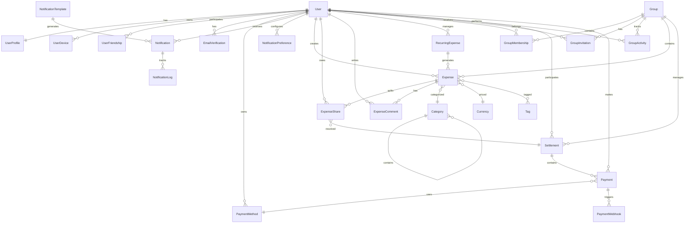

# 🗄️ Database Schema Documentation

## Table of Contents
- [Overview](#overview)
- [Database Design Principles](#database-design-principles)
- [Entity Relationship Diagram](#entity-relationship-diagram)
- [Schema Domains](#schema-domains)
  - [Authentication Domain](#authentication-domain)
  - [Core Domain](#core-domain)
  - [Expense Domain](#expense-domain)
  - [Group Domain](#group-domain)
  - [Payment Domain](#payment-domain)
  - [Analytics Domain](#analytics-domain)
  - [Notification Domain](#notification-domain)
- [Indexes & Performance](#indexes--performance)
- [Data Types & Constraints](#data-types--constraints)
- [Migration Strategy](#migration-strategy)

---

## Overview

The Expense Tracker database is designed using PostgreSQL 13+ with a focus on data integrity, performance, and scalability. The schema follows a domain-driven design approach with clear separation between different functional areas.

### Key Statistics
- **Total Tables**: 30+
- **Total Indexes**: 50+
- **Primary Database**: PostgreSQL 13+
- **Caching Layer**: Redis 7.0
- **Average Row Size**: ~500 bytes
- **Expected Scale**: 1M+ users, 100M+ expenses

---

## Database Design Principles

1. **Normalization**: Third Normal Form (3NF) with selective denormalization for performance
2. **UUID Primary Keys**: For distributed systems compatibility
3. **Soft Deletes**: Maintaining audit trail with `is_deleted` flags
4. **Timestamped Models**: All tables include `created_at` and `updated_at`
5. **JSON Fields**: For flexible metadata storage
6. **Composite Indexes**: For common query patterns
7. **Foreign Key Constraints**: Ensuring referential integrity

---

## Entity Relationship Diagram



---

## Schema Domains

## Authentication Domain

### 📊 Table: `auth_user`
**Description**: Custom user model extending Django's AbstractUser

| Column | Type | Constraints | Description |
|--------|------|-------------|-------------|
| `id` | BIGSERIAL | PRIMARY KEY | Auto-incrementing ID |
| `username` | VARCHAR(150) | UNIQUE, NOT NULL | Unique username |
| `email` | VARCHAR(254) | UNIQUE, NOT NULL, INDEX | Email address |
| `password` | VARCHAR(128) | NOT NULL | Hashed password |
| `first_name` | VARCHAR(150) | | First name |
| `last_name` | VARCHAR(150) | | Last name |
| `phone_number` | VARCHAR(17) | | Phone with country code |
| `avatar` | VARCHAR(100) | | Avatar image path |
| `bio` | TEXT | | User biography |
| `date_of_birth` | DATE | | Birth date |
| `preferred_currency` | VARCHAR(3) | DEFAULT 'USD' | Default currency code |
| `timezone` | VARCHAR(50) | DEFAULT 'UTC' | User timezone |
| `user_notification_preferences` | JSONB | DEFAULT '{}' | Notification settings |
| `role` | VARCHAR(20) | DEFAULT 'user' | User role (user/premium/admin) |
| `is_verified` | BOOLEAN | DEFAULT FALSE | Email verification status |
| `is_premium` | BOOLEAN | DEFAULT FALSE | Premium subscription status |
| `profile_visibility` | VARCHAR(20) | DEFAULT 'friends' | Profile visibility setting |
| `last_login_ip` | INET | | Last login IP address |
| `failed_login_attempts` | INTEGER | DEFAULT 0 | Failed login counter |
| `account_locked_until` | TIMESTAMP | | Account lock expiration |
| `is_active` | BOOLEAN | DEFAULT TRUE | Account active status |
| `is_staff` | BOOLEAN | DEFAULT FALSE | Staff status |
| `is_superuser` | BOOLEAN | DEFAULT FALSE | Superuser status |
| `date_joined` | TIMESTAMP | NOT NULL | Registration date |
| `last_login` | TIMESTAMP | | Last login timestamp |
| `created_at` | TIMESTAMP | NOT NULL | Record creation time |
| `updated_at` | TIMESTAMP | NOT NULL | Last update time |

**Indexes**:
- `idx_user_email` ON (`email`)
- `idx_user_username` ON (`username`)
- `idx_user_is_active` ON (`is_active`, `is_verified`)

### 📊 Table: `user_profiles`
**Description**: Extended user profile information

| Column | Type | Constraints | Description |
|--------|------|-------------|-------------|
| `id` | UUID | PRIMARY KEY | UUID identifier |
| `user_id` | BIGINT | UNIQUE, FK(auth_user), NOT NULL | User reference |
| `occupation` | VARCHAR(100) | | User's occupation |
| `company` | VARCHAR(100) | | Company name |
| `website` | VARCHAR(200) | | Personal website |
| `country` | VARCHAR(50) | | Country |
| `city` | VARCHAR(50) | | City |
| `social_links` | JSONB | DEFAULT '{}' | Social media links |
| `total_expenses` | DECIMAL(15,2) | DEFAULT 0 | Denormalized total |
| `total_groups` | INTEGER | DEFAULT 0 | Group count cache |
| `expense_count` | INTEGER | DEFAULT 0 | Expense count cache |
| `created_at` | TIMESTAMP | NOT NULL | Creation timestamp |
| `updated_at` | TIMESTAMP | NOT NULL | Update timestamp |

**Indexes**:
- `idx_profile_user` ON (`user_id`)

### 📊 Table: `user_friendships`
**Description**: User-to-user friendship relationships

| Column | Type | Constraints | Description |
|--------|------|-------------|-------------|
| `id` | UUID | PRIMARY KEY | UUID identifier |
| `from_user_id` | BIGINT | FK(auth_user), NOT NULL | Friendship initiator |
| `to_user_id` | BIGINT | FK(auth_user), NOT NULL | Friendship recipient |
| `status` | VARCHAR(20) | DEFAULT 'pending' | Status (pending/accepted/blocked/declined) |
| `message` | TEXT | | Invitation message |
| `created_at` | TIMESTAMP | NOT NULL | Request time |
| `updated_at` | TIMESTAMP | NOT NULL | Last update |

**Constraints**:
- UNIQUE (`from_user_id`, `to_user_id`)
- CHECK (`from_user_id` != `to_user_id`)

**Indexes**:
- `idx_friendship_users` ON (`from_user_id`, `to_user_id`)
- `idx_friendship_status` ON (`status`)

### 📊 Table: `user_devices`
**Description**: User devices for push notifications

| Column | Type | Constraints | Description |
|--------|------|-------------|-------------|
| `id` | UUID | PRIMARY KEY | UUID identifier |
| `user_id` | BIGINT | FK(auth_user), NOT NULL | Device owner |
| `device_token` | VARCHAR(255) | UNIQUE, NOT NULL | Push notification token |
| `device_type` | VARCHAR(20) | NOT NULL | Type (ios/android/web) |
| `device_name` | VARCHAR(100) | | Device name |
| `is_active` | BOOLEAN | DEFAULT TRUE | Active status |
| `last_used` | TIMESTAMP | | Last activity |
| `created_at` | TIMESTAMP | NOT NULL | Registration time |
| `updated_at` | TIMESTAMP | NOT NULL | Update time |

**Indexes**:
- `idx_device_user` ON (`user_id`, `is_active`)
- `idx_device_token` ON (`device_token`)

### 📊 Table: `email_verifications`
**Description**: Email verification tokens

| Column | Type | Constraints | Description |
|--------|------|-------------|-------------|
| `id` | UUID | PRIMARY KEY | UUID identifier |
| `user_id` | BIGINT | FK(auth_user), NOT NULL | User reference |
| `token` | VARCHAR(100) | UNIQUE, NOT NULL | Verification token |
| `email` | VARCHAR(254) | NOT NULL | Email to verify |
| `is_used` | BOOLEAN | DEFAULT FALSE | Usage status |
| `expires_at` | TIMESTAMP | NOT NULL | Expiration time |
| `created_at` | TIMESTAMP | NOT NULL | Creation time |
| `updated_at` | TIMESTAMP | NOT NULL | Update time |

**Indexes**:
- `idx_verification_token` ON (`token`)
- `idx_verification_user` ON (`user_id`, `is_used`)

---

## Core Domain

### 📊 Table: `currencies`
**Description**: Currency information and exchange rates

| Column | Type | Constraints | Description |
|--------|------|-------------|-------------|
| `id` | UUID | PRIMARY KEY | UUID identifier |
| `code` | VARCHAR(3) | UNIQUE, NOT NULL | ISO currency code |
| `name` | VARCHAR(50) | NOT NULL | Currency name |
| `symbol` | VARCHAR(10) | NOT NULL | Currency symbol |
| `decimal_places` | SMALLINT | DEFAULT 2 | Decimal precision |
| `exchange_rate_to_usd` | DECIMAL(20,10) | DEFAULT 1 | USD exchange rate |
| `is_active` | BOOLEAN | DEFAULT TRUE | Active status |
| `created_at` | TIMESTAMP | NOT NULL | Creation time |
| `updated_at` | TIMESTAMP | NOT NULL | Last rate update |

**Indexes**:
- `idx_currency_code` ON (`code`)
- `idx_currency_active` ON (`is_active`)

### 📊 Table: `categories`
**Description**: Expense categories with hierarchical structure

| Column | Type | Constraints | Description |
|--------|------|-------------|-------------|
| `id` | UUID | PRIMARY KEY | UUID identifier |
| `name` | VARCHAR(100) | UNIQUE, NOT NULL | Category name |
| `slug` | VARCHAR(100) | UNIQUE, NOT NULL | URL-safe slug |
| `description` | TEXT | | Description |
| `icon` | VARCHAR(50) | | Icon identifier |
| `color` | VARCHAR(7) | DEFAULT '#007bff' | Hex color code |
| `is_default` | BOOLEAN | DEFAULT FALSE | System default |
| `parent_id` | UUID | FK(categories) | Parent category |
| `created_at` | TIMESTAMP | NOT NULL | Creation time |
| `updated_at` | TIMESTAMP | NOT NULL | Update time |

**Indexes**:
- `idx_category_name` ON (`name`)
- `idx_category_slug` ON (`slug`)
- `idx_category_parent` ON (`parent_id`)

### 📊 Table: `tags`
**Description**: User-defined tags for expenses

| Column | Type | Constraints | Description |
|--------|------|-------------|-------------|
| `id` | UUID | PRIMARY KEY | UUID identifier |
| `name` | VARCHAR(50) | UNIQUE, NOT NULL | Tag name |
| `color` | VARCHAR(7) | DEFAULT '#6c757d' | Hex color |
| `description` | TEXT | | Description |
| `usage_count` | INTEGER | DEFAULT 0 | Usage counter |
| `created_at` | TIMESTAMP | NOT NULL | Creation time |
| `updated_at` | TIMESTAMP | NOT NULL | Update time |

**Indexes**:
- `idx_tag_name` ON (`name`)
- `idx_tag_usage` ON (`usage_count` DESC)

### 📊 Table: `countries`
**Description**: Country information

| Column | Type | Constraints | Description |
|--------|------|-------------|-------------|
| `id` | UUID | PRIMARY KEY | UUID identifier |
| `name` | VARCHAR(100) | UNIQUE, NOT NULL | Country name |
| `code` | VARCHAR(2) | UNIQUE, NOT NULL | ISO country code |
| `currency_id` | UUID | FK(currencies) | Default currency |
| `phone_code` | VARCHAR(10) | | Phone country code |
| `flag_emoji` | VARCHAR(10) | | Flag emoji |
| `created_at` | TIMESTAMP | NOT NULL | Creation time |
| `updated_at` | TIMESTAMP | NOT NULL | Update time |

**Indexes**:
- `idx_country_code` ON (`code`)
- `idx_country_currency` ON (`currency_id`)

### 📊 Table: `system_configurations`
**Description**: System-wide configuration settings

| Column | Type | Constraints | Description |
|--------|------|-------------|-------------|
| `id` | UUID | PRIMARY KEY | UUID identifier |
| `key` | VARCHAR(100) | UNIQUE, NOT NULL | Configuration key |
| `value` | TEXT | NOT NULL | Configuration value |
| `data_type` | VARCHAR(20) | DEFAULT 'string' | Value type |
| `description` | TEXT | | Description |
| `is_sensitive` | BOOLEAN | DEFAULT FALSE | Sensitive data flag |
| `created_at` | TIMESTAMP | NOT NULL | Creation time |
| `updated_at` | TIMESTAMP | NOT NULL | Update time |

**Indexes**:
- `idx_config_key` ON (`key`)

### 📊 Table: `activity_logs`
**Description**: Audit trail for user activities

| Column | Type | Constraints | Description |
|--------|------|-------------|-------------|
| `id` | UUID | PRIMARY KEY | UUID identifier |
| `user_id` | BIGINT | FK(auth_user) | Acting user |
| `action` | VARCHAR(20) | NOT NULL | Action type |
| `content_type` | VARCHAR(50) | | Model name |
| `object_id` | VARCHAR(100) | | Object identifier |
| `object_repr` | VARCHAR(200) | | Object representation |
| `changes` | JSONB | DEFAULT '{}' | Change details |
| `ip_address` | INET | | User IP |
| `user_agent` | TEXT | | Browser user agent |
| `created_at` | TIMESTAMP | NOT NULL | Action time |
| `updated_at` | TIMESTAMP | NOT NULL | Update time |

**Indexes**:
- `idx_activity_user_action` ON (`user_id`, `action`, `created_at`)
- `idx_activity_object` ON (`content_type`, `object_id`)

---

## Expense Domain

### 📊 Table: `expenses`
**Description**: Core expense records

| Column | Type | Constraints | Description |
|--------|------|-------------|-------------|
| `id` | UUID | PRIMARY KEY | UUID identifier |
| `title` | VARCHAR(200) | NOT NULL, INDEX | Expense title |
| `description` | TEXT | | Detailed description |
| `amount` | DECIMAL(15,2) | NOT NULL, CHECK > 0 | Expense amount |
| `currency_id` | UUID | FK(currencies), NOT NULL | Currency |
| `category_id` | UUID | FK(categories) | Category |
| `expense_type` | VARCHAR(20) | DEFAULT 'individual' | Type (individual/group/recurring) |
| `group_id` | UUID | FK(groups) | Associated group |
| `paid_by_id` | BIGINT | FK(auth_user), NOT NULL | Payer |
| `expense_date` | DATE | NOT NULL, INDEX | Expense date |
| `split_type` | VARCHAR(20) | DEFAULT 'equal' | Split method |
| `split_data` | JSONB | DEFAULT '{}' | Split details |
| `receipt` | VARCHAR(255) | | Receipt image path |
| `attachments` | JSONB | DEFAULT '[]' | Additional files |
| `ocr_data` | JSONB | DEFAULT '{}' | OCR extracted data |
| `vendor` | VARCHAR(200) | | Merchant name |
| `location` | VARCHAR(200) | | Location |
| `is_settled` | BOOLEAN | DEFAULT FALSE, INDEX | Settlement status |
| `is_recurring` | BOOLEAN | DEFAULT FALSE | Recurring flag |
| `parent_expense_id` | UUID | FK(expenses) | Parent for recurring |
| `requires_approval` | BOOLEAN | DEFAULT FALSE | Approval requirement |
| `is_approved` | BOOLEAN | DEFAULT TRUE | Approval status |
| `approved_by_id` | BIGINT | FK(auth_user) | Approver |
| `approved_at` | TIMESTAMP | | Approval time |
| `is_deleted` | BOOLEAN | DEFAULT FALSE | Soft delete flag |
| `deleted_at` | TIMESTAMP | | Deletion time |
| `deleted_by_id` | BIGINT | FK(auth_user) | Deleter |
| `created_at` | TIMESTAMP | NOT NULL | Creation time |
| `updated_at` | TIMESTAMP | NOT NULL | Update time |

**Indexes**:
- `idx_expense_date_group` ON (`expense_date`, `group_id`)
- `idx_expense_payer_date` ON (`paid_by_id`, `expense_date`)
- `idx_expense_category_date` ON (`category_id`, `expense_date`)
- `idx_expense_settled_group` ON (`is_settled`, `group_id`)
- `idx_expense_title_search` ON (`title`) USING gin(to_tsvector('english', title))

### 📊 Table: `expense_shares`
**Description**: Individual shares of expenses

| Column | Type | Constraints | Description |
|--------|------|-------------|-------------|
| `id` | UUID | PRIMARY KEY | UUID identifier |
| `expense_id` | UUID | FK(expenses), NOT NULL | Parent expense |
| `user_id` | BIGINT | FK(auth_user), NOT NULL | Share owner |
| `amount` | DECIMAL(15,2) | NOT NULL, CHECK > 0 | Share amount |
| `currency_id` | UUID | FK(currencies), NOT NULL | Currency |
| `paid_by_id` | BIGINT | FK(auth_user), NOT NULL | Original payer |
| `is_settled` | BOOLEAN | DEFAULT FALSE, INDEX | Settlement status |
| `settled_at` | TIMESTAMP | | Settlement time |
| `settlement_id` | UUID | FK(settlements) | Settlement reference |
| `created_at` | TIMESTAMP | NOT NULL | Creation time |
| `updated_at` | TIMESTAMP | NOT NULL | Update time |

**Constraints**:
- UNIQUE (`expense_id`, `user_id`)

**Indexes**:
- `idx_share_user_settled` ON (`user_id`, `is_settled`)
- `idx_share_payer_settled` ON (`paid_by_id`, `is_settled`)
- `idx_share_expense_user` ON (`expense_id`, `user_id`)

### 📊 Table: `expense_tags`
**Description**: Many-to-many relationship between expenses and tags

| Column | Type | Constraints | Description |
|--------|------|-------------|-------------|
| `expense_id` | UUID | FK(expenses), NOT NULL | Expense |
| `tag_id` | UUID | FK(tags), NOT NULL | Tag |

**Constraints**:
- PRIMARY KEY (`expense_id`, `tag_id`)

### 📊 Table: `recurring_expenses`
**Description**: Templates for recurring expenses

| Column | Type | Constraints | Description |
|--------|------|-------------|-------------|
| `id` | UUID | PRIMARY KEY | UUID identifier |
| `title` | VARCHAR(200) | NOT NULL | Template title |
| `description` | TEXT | | Description |
| `amount` | DECIMAL(15,2) | NOT NULL, CHECK > 0 | Amount |
| `currency_id` | UUID | FK(currencies), NOT NULL | Currency |
| `category_id` | UUID | FK(categories) | Category |
| `frequency` | VARCHAR(20) | NOT NULL | Frequency type |
| `interval` | INTEGER | DEFAULT 1, CHECK > 0 | Interval multiplier |
| `group_id` | UUID | FK(groups) | Associated group |
| `created_by_id` | BIGINT | FK(auth_user), NOT NULL | Creator |
| `paid_by_id` | BIGINT | FK(auth_user), NOT NULL | Default payer |
| `start_date` | DATE | NOT NULL | Start date |
| `end_date` | DATE | | End date |
| `next_due_date` | DATE | NOT NULL, INDEX | Next occurrence |
| `split_type` | VARCHAR(20) | DEFAULT 'equal' | Split method |
| `split_data` | JSONB | DEFAULT '{}' | Split details |
| `is_active` | BOOLEAN | DEFAULT TRUE, INDEX | Active status |
| `is_paused` | BOOLEAN | DEFAULT FALSE | Pause status |
| `paused_until` | DATE | | Pause end date |
| `created_at` | TIMESTAMP | NOT NULL | Creation time |
| `updated_at` | TIMESTAMP | NOT NULL | Update time |

**Indexes**:
- `idx_recurring_next_active` ON (`next_due_date`, `is_active`)
- `idx_recurring_group_active` ON (`group_id`, `is_active`)
- `idx_recurring_creator_active` ON (`created_by_id`, `is_active`)

### 📊 Table: `expense_comments`
**Description**: Comments on expenses

| Column | Type | Constraints | Description |
|--------|------|-------------|-------------|
| `id` | UUID | PRIMARY KEY | UUID identifier |
| `expense_id` | UUID | FK(expenses), NOT NULL | Parent expense |
| `user_id` | BIGINT | FK(auth_user), NOT NULL | Commenter |
| `comment` | TEXT | NOT NULL | Comment text |
| `parent_id` | UUID | FK(expense_comments) | Parent comment |
| `is_edited` | BOOLEAN | DEFAULT FALSE | Edit flag |
| `edited_at` | TIMESTAMP | | Edit time |
| `created_at` | TIMESTAMP | NOT NULL | Creation time |
| `updated_at` | TIMESTAMP | NOT NULL | Update time |

**Indexes**:
- `idx_comment_expense` ON (`expense_id`, `created_at`)
- `idx_comment_user` ON (`user_id`, `created_at`)

---

## Group Domain

### 📊 Table: `groups`
**Description**: Expense sharing groups

| Column | Type | Constraints | Description |
|--------|------|-------------|-------------|
| `id` | UUID | PRIMARY KEY | UUID identifier |
| `name` | VARCHAR(100) | NOT NULL, INDEX | Group name |
| `description` | TEXT | | Description |
| `group_type` | VARCHAR(20) | DEFAULT 'other' | Type (personal/trip/home/couple/project/other) |
| `image` | VARCHAR(255) | | Group image path |
| `currency_id` | UUID | FK(currencies), NOT NULL | Default currency |
| `is_private` | BOOLEAN | DEFAULT FALSE | Privacy setting |
| `invite_code` | VARCHAR(12) | UNIQUE | Invitation code |
| `member_count` | INTEGER | DEFAULT 0 | Member count cache |
| `total_expenses` | DECIMAL(15,2) | DEFAULT 0 | Total expenses cache |
| `settled_amount` | DECIMAL(15,2) | DEFAULT 0 | Settled amount cache |
| `is_active` | BOOLEAN | DEFAULT TRUE, INDEX | Active status |
| `is_archived` | BOOLEAN | DEFAULT FALSE | Archive status |
| `archived_at` | TIMESTAMP | | Archive time |
| `created_at` | TIMESTAMP | NOT NULL | Creation time |
| `updated_at` | TIMESTAMP | NOT NULL | Update time |

**Indexes**:
- `idx_group_name_active` ON (`name`, `is_active`)
- `idx_group_invite_code` ON (`invite_code`)

### 📊 Table: `group_memberships`
**Description**: User membership in groups

| Column | Type | Constraints | Description |
|--------|------|-------------|-------------|
| `id` | UUID | PRIMARY KEY | UUID identifier |
| `user_id` | BIGINT | FK(auth_user), NOT NULL | Member user |
| `group_id` | UUID | FK(groups), NOT NULL | Group |
| `role` | VARCHAR(20) | DEFAULT 'member' | Role (admin/member/viewer) |
| `status` | VARCHAR(20) | DEFAULT 'pending' | Status (pending/accepted/declined/left/removed) |
| `invited_by_id` | BIGINT | FK(auth_user) | Inviter |
| `invitation_message` | TEXT | | Invitation message |
| `is_active` | BOOLEAN | DEFAULT TRUE, INDEX | Active status |
| `joined_at` | TIMESTAMP | | Join time |
| `left_at` | TIMESTAMP | | Leave time |
| `notification_preferences` | JSONB | DEFAULT '{}' | Group notifications |
| `created_at` | TIMESTAMP | NOT NULL | Creation time |
| `updated_at` | TIMESTAMP | NOT NULL | Update time |

**Constraints**:
- UNIQUE (`user_id`, `group_id`)

**Indexes**:
- `idx_membership_group_active` ON (`group_id`, `is_active`)
- `idx_membership_user_active` ON (`user_id`, `is_active`)

### 📊 Table: `group_invitations`
**Description**: Pending group invitations

| Column | Type | Constraints | Description |
|--------|------|-------------|-------------|
| `id` | UUID | PRIMARY KEY | UUID identifier |
| `group_id` | UUID | FK(groups), NOT NULL | Target group |
| `invited_by_id` | BIGINT | FK(auth_user), NOT NULL | Inviter |
| `email` | VARCHAR(254) | | Invitee email |
| `phone_number` | VARCHAR(17) | | Invitee phone |
| `message` | TEXT | | Invitation message |
| `is_accepted` | BOOLEAN | DEFAULT FALSE | Acceptance status |
| `is_expired` | BOOLEAN | DEFAULT FALSE | Expiration status |
| `accepted_by_id` | BIGINT | FK(auth_user) | Acceptor |
| `expires_at` | TIMESTAMP | NOT NULL | Expiration time |
| `accepted_at` | TIMESTAMP | | Acceptance time |
| `created_at` | TIMESTAMP | NOT NULL | Creation time |
| `updated_at` | TIMESTAMP | NOT NULL | Update time |

**Indexes**:
- `idx_invitation_email` ON (`email`, `is_accepted`)
- `idx_invitation_group` ON (`group_id`, `is_accepted`)

### 📊 Table: `group_activities`
**Description**: Activity feed for groups

| Column | Type | Constraints | Description |
|--------|------|-------------|-------------|
| `id` | UUID | PRIMARY KEY | UUID identifier |
| `group_id` | UUID | FK(groups), NOT NULL | Group |
| `user_id` | BIGINT | FK(auth_user), NOT NULL | Actor |
| `activity_type` | VARCHAR(20) | NOT NULL, INDEX | Activity type |
| `description` | TEXT | NOT NULL | Description |
| `metadata` | JSONB | DEFAULT '{}' | Additional data |
| `created_at` | TIMESTAMP | NOT NULL | Activity time |
| `updated_at` | TIMESTAMP | NOT NULL | Update time |

**Indexes**:
- `idx_activity_group` ON (`group_id`, `created_at`)
- `idx_activity_user_type` ON (`user_id`, `activity_type`)

---

## Payment Domain

### 📊 Table: `payment_methods`
**Description**: User payment methods

| Column | Type | Constraints | Description |
|--------|------|-------------|-------------|
| `id` | UUID | PRIMARY KEY | UUID identifier |
| `user_id` | BIGINT | FK(auth_user), NOT NULL | Owner |
| `method_type` | VARCHAR(20) | NOT NULL | Type (bank/paypal/stripe/etc) |
| `name` | VARCHAR(100) | NOT NULL | Display name |
| `details` | JSONB | DEFAULT '{}' | Method details |
| `external_id` | VARCHAR(255) | | External service ID |
| `metadata` | JSONB | DEFAULT '{}' | Additional metadata |
| `is_active` | BOOLEAN | DEFAULT TRUE, INDEX | Active status |
| `is_verified` | BOOLEAN | DEFAULT FALSE | Verification status |
| `is_default` | BOOLEAN | DEFAULT FALSE | Default method |
| `created_at` | TIMESTAMP | NOT NULL | Creation time |
| `updated_at` | TIMESTAMP | NOT NULL | Update time |

**Indexes**:
- `idx_payment_method_user` ON (`user_id`, `is_active`)
- `idx_payment_method_type` ON (`method_type`, `is_active`)

### 📊 Table: `settlements`
**Description**: Money settlements between users

| Column | Type | Constraints | Description |
|--------|------|-------------|-------------|
| `id` | UUID | PRIMARY KEY | UUID identifier |
| `payer_id` | BIGINT | FK(auth_user), NOT NULL | Payer |
| `payee_id` | BIGINT | FK(auth_user), NOT NULL | Payee |
| `amount` | DECIMAL(15,2) | NOT NULL, CHECK > 0 | Amount |
| `currency_id` | UUID | FK(currencies), NOT NULL | Currency |
| `group_id` | UUID | FK(groups) | Associated group |
| `method` | VARCHAR(20) | DEFAULT 'manual' | Method (manual/automatic/external) |
| `status` | VARCHAR(20) | DEFAULT 'pending', INDEX | Status |
| `payment_method_id` | UUID | FK(payment_methods) | Payment method |
| `external_transaction_id` | VARCHAR(255) | | External ID |
| `payment_service` | VARCHAR(50) | | Service name |
| `payment_metadata` | JSONB | DEFAULT '{}' | Payment data |
| `due_date` | TIMESTAMP | | Due date |
| `completed_at` | TIMESTAMP | | Completion time |
| `description` | TEXT | | Description |
| `notes` | TEXT | | Notes |
| `is_confirmed_by_payer` | BOOLEAN | DEFAULT FALSE | Payer confirmation |
| `is_confirmed_by_payee` | BOOLEAN | DEFAULT FALSE | Payee confirmation |
| `confirmed_at` | TIMESTAMP | | Confirmation time |
| `created_at` | TIMESTAMP | NOT NULL | Creation time |
| `updated_at` | TIMESTAMP | NOT NULL | Update time |

**Indexes**:
- `idx_settlement_payer_status` ON (`payer_id`, `status`)
- `idx_settlement_payee_status` ON (`payee_id`, `status`)
- `idx_settlement_group_status` ON (`group_id`, `status`)
- `idx_settlement_status_due` ON (`status`, `due_date`)

### 📊 Table: `payments`
**Description**: Actual payment transactions

| Column | Type | Constraints | Description |
|--------|------|-------------|-------------|
| `id` | UUID | PRIMARY KEY | UUID identifier |
| `settlement_id` | UUID | FK(settlements), NOT NULL | Settlement |
| `amount` | DECIMAL(15,2) | NOT NULL, CHECK > 0 | Amount |
| `currency_id` | UUID | FK(currencies), NOT NULL | Currency |
| `payment_method_id` | UUID | FK(payment_methods), NOT NULL | Payment method |
| `status` | VARCHAR(20) | DEFAULT 'pending', INDEX | Status |
| `external_transaction_id` | VARCHAR(255) | UNIQUE | External ID |
| `payment_service` | VARCHAR(50) | NOT NULL | Service name |
| `processing_fee` | DECIMAL(15,2) | DEFAULT 0 | Processing fee |
| `initiated_at` | TIMESTAMP | NOT NULL | Initiation time |
| `processed_at` | TIMESTAMP | | Processing time |
| `metadata` | JSONB | DEFAULT '{}' | Service metadata |
| `error_code` | VARCHAR(100) | | Error code |
| `error_message` | TEXT | | Error message |
| `created_at` | TIMESTAMP | NOT NULL | Creation time |
| `updated_at` | TIMESTAMP | NOT NULL | Update time |

**Indexes**:
- `idx_payment_status` ON (`status`, `initiated_at`)
- `idx_payment_external_id` ON (`external_transaction_id`)
- `idx_payment_settlement` ON (`settlement_id`, `status`)

### 📊 Table: `payment_webhooks`
**Description**: Webhook events from payment services

| Column | Type | Constraints | Description |
|--------|------|-------------|-------------|
| `id` | UUID | PRIMARY KEY | UUID identifier |
| `service` | VARCHAR(20) | NOT NULL | Service name |
| `event_id` | VARCHAR(255) | UNIQUE | Event identifier |
| `event_type` | VARCHAR(100) | NOT NULL | Event type |
| `raw_payload` | JSONB | NOT NULL | Raw webhook data |
| `processed_payload` | JSONB | DEFAULT '{}' | Processed data |
| `status` | VARCHAR(20) | DEFAULT 'received' | Processing status |
| `processed_at` | TIMESTAMP | | Processing time |
| `payment_id` | UUID | FK(payments) | Related payment |
| `error_message` | TEXT | | Error message |
| `retry_count` | INTEGER | DEFAULT 0 | Retry attempts |
| `created_at` | TIMESTAMP | NOT NULL | Receipt time |
| `updated_at` | TIMESTAMP | NOT NULL | Update time |

**Indexes**:
- `idx_webhook_service_type` ON (`service`, `event_type`)
- `idx_webhook_status` ON (`status`, `created_at`)

---

## Analytics Domain

### 📊 Table: `expense_analytics`
**Description**: Pre-calculated expense analytics

| Column | Type | Constraints | Description |
|--------|------|-------------|-------------|
| `id` | UUID | PRIMARY KEY | UUID identifier |
| `user_id` | BIGINT | FK(auth_user) | User scope |
| `group_id` | UUID | FK(groups) | Group scope |
| `category_id` | UUID | FK(categories) | Category scope |
| `period_type` | VARCHAR(20) | NOT NULL | Period type |
| `period_start` | DATE | NOT NULL, INDEX | Period start |
| `period_end` | DATE | NOT NULL, INDEX | Period end |
| `total_amount` | DECIMAL(15,2) | DEFAULT 0 | Total amount |
| `currency_id` | UUID | FK(currencies), NOT NULL | Currency |
| `expense_count` | INTEGER | DEFAULT 0 | Expense count |
| `average_amount` | DECIMAL(15,2) | DEFAULT 0 | Average amount |
| `category_breakdown` | JSONB | DEFAULT '{}' | Category distribution |
| `trend_percentage` | DECIMAL(5,2) | DEFAULT 0 | Trend from previous |
| `created_at` | TIMESTAMP | NOT NULL | Calculation time |
| `updated_at` | TIMESTAMP | NOT NULL | Update time |

**Constraints**:
- UNIQUE (`user_id`, `group_id`, `category_id`, `period_type`, `period_start`)

**Indexes**:
- `idx_analytics_user_period` ON (`user_id`, `period_type`, `period_start`)
- `idx_analytics_group_period` ON (`group_id`, `period_type`, `period_start`)
- `idx_analytics_category` ON (`category_id`, `period_start`)

### 📊 Table: `user_spending_patterns`
**Description**: User spending behavior analysis

| Column | Type | Constraints | Description |
|--------|------|-------------|-------------|
| `id` | UUID | PRIMARY KEY | UUID identifier |
| `user_id` | BIGINT | FK(auth_user), NOT NULL | User |
| `analysis_date` | DATE | NOT NULL, INDEX | Analysis date |
| `most_active_day` | VARCHAR(10) | | Most active weekday |
| `most_active_hour` | SMALLINT | | Most active hour (0-23) |
| `top_categories` | JSONB | DEFAULT '[]' | Top categories list |
| `category_distribution` | JSONB | DEFAULT '{}' | Category percentages |
| `average_expense_amount` | DECIMAL(15,2) | DEFAULT 0 | Average amount |
| `expense_frequency` | DECIMAL(5,2) | DEFAULT 0 | Expenses per day |
| `group_vs_individual_ratio` | DECIMAL(5,2) | DEFAULT 0 | Group expense ratio |
| `most_active_groups` | JSONB | DEFAULT '[]' | Most active groups |
| `seasonal_spending` | JSONB | DEFAULT '{}' | Monthly averages |
| `created_at` | TIMESTAMP | NOT NULL | Analysis time |
| `updated_at` | TIMESTAMP | NOT NULL | Update time |

**Constraints**:
- UNIQUE (`user_id`, `analysis_date`)

### 📊 Table: `report_templates`
**Description**: Custom report templates

| Column | Type | Constraints | Description |
|--------|------|-------------|-------------|
| `id` | UUID | PRIMARY KEY | UUID identifier |
| `name` | VARCHAR(100) | NOT NULL | Template name |
| `description` | TEXT | | Description |
| `report_type` | VARCHAR(30) | NOT NULL | Report type |
| `created_by_id` | BIGINT | FK(auth_user), NOT NULL | Creator |
| `filters` | JSONB | DEFAULT '{}' | Filter settings |
| `fields` | JSONB | DEFAULT '[]' | Included fields |
| `grouping` | JSONB | DEFAULT '{}' | Grouping settings |
| `sorting` | JSONB | DEFAULT '{}' | Sort settings |
| `output_format` | VARCHAR(10) | DEFAULT 'pdf' | Output format |
| `styling` | JSONB | DEFAULT '{}' | Style settings |
| `is_public` | BOOLEAN | DEFAULT FALSE | Public visibility |
| `usage_count` | INTEGER | DEFAULT 0 | Usage counter |
| `last_used` | TIMESTAMP | | Last usage time |
| `created_at` | TIMESTAMP | NOT NULL | Creation time |
| `updated_at` | TIMESTAMP | NOT NULL | Update time |

**Indexes**:
- `idx_template_creator` ON (`created_by_id`, `report_type`)
- `idx_template_public` ON (`is_public`, `usage_count`)

### 📊 Table: `generated_reports`
**Description**: Generated report instances

| Column | Type | Constraints | Description |
|--------|------|-------------|-------------|
| `id` | UUID | PRIMARY KEY | UUID identifier |
| `template_id` | UUID | FK(report_templates), NOT NULL | Template |
| `generated_by_id` | BIGINT | FK(auth_user), NOT NULL | Generator |
| `parameters` | JSONB | DEFAULT '{}' | Runtime parameters |
| `status` | VARCHAR(20) | DEFAULT 'queued' | Generation status |
| `started_at` | TIMESTAMP | | Start time |
| `completed_at` | TIMESTAMP | | Completion time |
| `expires_at` | TIMESTAMP | | Expiration time |
| `file_path` | VARCHAR(500) | | File location |
| `file_size` | BIGINT | | File size (bytes) |
| `download_count` | INTEGER | DEFAULT 0 | Download counter |
| `error_message` | TEXT | | Error message |
| `created_at` | TIMESTAMP | NOT NULL | Request time |
| `updated_at` | TIMESTAMP | NOT NULL | Update time |

**Indexes**:
- `idx_report_generator` ON (`generated_by_id`, `status`)
- `idx_report_status` ON (`status`, `expires_at`)

---

## Notification Domain

### 📊 Table: `notifications`
**Description**: User notifications

| Column | Type | Constraints | Description |
|--------|------|-------------|-------------|
| `id` | UUID | PRIMARY KEY | UUID identifier |
| `user_id` | BIGINT | FK(auth_user), NOT NULL | Recipient |
| `sender_id` | BIGINT | FK(auth_user) | Sender |
| `notification_type` | VARCHAR(30) | NOT NULL, INDEX | Type |
| `title` | VARCHAR(200) | NOT NULL | Title |
| `message` | TEXT | NOT NULL | Message body |
| `priority` | VARCHAR(10) | DEFAULT 'normal' | Priority level |
| `is_read` | BOOLEAN | DEFAULT FALSE, INDEX | Read status |
| `read_at` | TIMESTAMP | | Read time |
| `related_object_type` | VARCHAR(50) | | Related model |
| `related_object_id` | VARCHAR(100) | | Related object ID |
| `action_url` | VARCHAR(500) | | Action URL |
| `metadata` | JSONB | DEFAULT '{}' | Additional data |
| `is_sent` | BOOLEAN | DEFAULT FALSE | Sent status |
| `sent_at` | TIMESTAMP | | Send time |
| `delivery_channels` | JSONB | DEFAULT '[]' | Delivery channels |
| `created_at` | TIMESTAMP | NOT NULL | Creation time |
| `updated_at` | TIMESTAMP | NOT NULL | Update time |

**Indexes**:
- `idx_notification_user_read` ON (`user_id`, `is_read`, `created_at`)
- `idx_notification_type` ON (`notification_type`, `created_at`)
- `idx_notification_priority` ON (`priority`, `is_sent`)

### 📊 Table: `notification_preferences`
**Description**: User notification preferences

| Column | Type | Constraints | Description |
|--------|------|-------------|-------------|
| `id` | UUID | PRIMARY KEY | UUID identifier |
| `user_id` | BIGINT | FK(auth_user), NOT NULL | User |
| `notification_type` | VARCHAR(30) | NOT NULL | Notification type |
| `is_enabled` | BOOLEAN | DEFAULT TRUE | Enabled status |
| `delivery_methods` | JSONB | DEFAULT '[]' | Enabled methods |
| `quiet_hours_start` | TIME | | Quiet start time |
| `quiet_hours_end` | TIME | | Quiet end time |
| `frequency_limit` | VARCHAR(20) | DEFAULT 'immediate' | Frequency limit |
| `created_at` | TIMESTAMP | NOT NULL | Creation time |
| `updated_at` | TIMESTAMP | NOT NULL | Update time |

**Constraints**:
- UNIQUE (`user_id`, `notification_type`)

### 📊 Table: `notification_templates`
**Description**: Notification message templates

| Column | Type | Constraints | Description |
|--------|------|-------------|-------------|
| `id` | UUID | PRIMARY KEY | UUID identifier |
| `name` | VARCHAR(100) | UNIQUE | Template name |
| `notification_type` | VARCHAR(30) | NOT NULL | Notification type |
| `template_type` | VARCHAR(10) | NOT NULL | Template type (email/push/sms) |
| `subject` | VARCHAR(200) | | Email subject |
| `body` | TEXT | NOT NULL | Template body |
| `variables` | JSONB | DEFAULT '{}' | Available variables |
| `is_active` | BOOLEAN | DEFAULT TRUE | Active status |
| `language` | VARCHAR(10) | DEFAULT 'en' | Language code |
| `created_at` | TIMESTAMP | NOT NULL | Creation time |
| `updated_at` | TIMESTAMP | NOT NULL | Update time |

**Constraints**:
- UNIQUE (`notification_type`, `template_type`, `language`)

### 📊 Table: `notification_logs`
**Description**: Notification delivery logs

| Column | Type | Constraints | Description |
|--------|------|-------------|-------------|
| `id` | UUID | PRIMARY KEY | UUID identifier |
| `notification_id` | UUID | FK(notifications), NOT NULL | Notification |
| `delivery_method` | VARCHAR(10) | NOT NULL | Delivery method |
| `recipient` | VARCHAR(255) | NOT NULL | Recipient address |
| `status` | VARCHAR(20) | DEFAULT 'pending' | Delivery status |
| `external_id` | VARCHAR(255) | | External service ID |
| `sent_at` | TIMESTAMP | | Send time |
| `delivered_at` | TIMESTAMP | | Delivery time |
| `opened_at` | TIMESTAMP | | Open time |
| `clicked_at` | TIMESTAMP | | Click time |
| `error_message` | TEXT | | Error message |
| `retry_count` | INTEGER | DEFAULT 0 | Retry attempts |
| `metadata` | JSONB | DEFAULT '{}' | Service metadata |
| `created_at` | TIMESTAMP | NOT NULL | Log time |
| `updated_at` | TIMESTAMP | NOT NULL | Update time |

**Indexes**:
- `idx_log_notification` ON (`notification_id`, `delivery_method`)
- `idx_log_status` ON (`status`, `sent_at`)

---

## Indexes & Performance

### Performance-Critical Indexes

```sql
-- User queries
CREATE INDEX idx_user_email_active ON auth_user(email, is_active, is_verified);
CREATE INDEX idx_user_login ON auth_user(email, password, is_active);

-- Expense queries
CREATE INDEX idx_expense_user_date ON expenses(paid_by_id, expense_date DESC);
CREATE INDEX idx_expense_group_date ON expenses(group_id, expense_date DESC);
CREATE INDEX idx_expense_category ON expenses(category_id, expense_date DESC);
CREATE INDEX idx_expense_settlement ON expenses(is_settled, group_id);

-- Share queries
CREATE INDEX idx_share_balance ON expense_shares(user_id, is_settled, amount);
CREATE INDEX idx_share_payer ON expense_shares(paid_by_id, user_id, is_settled);

-- Group queries
CREATE INDEX idx_group_member ON group_memberships(group_id, user_id, is_active);
CREATE INDEX idx_group_user_active ON group_memberships(user_id, is_active);

-- Settlement queries
CREATE INDEX idx_settlement_pending ON settlements(status, due_date) WHERE status = 'pending';
CREATE INDEX idx_settlement_user ON settlements(payer_id, payee_id, status);

-- Notification queries
CREATE INDEX idx_notification_unread ON notifications(user_id, is_read, created_at DESC);

-- Full-text search
CREATE INDEX idx_expense_search ON expenses USING gin(to_tsvector('english', title || ' ' || COALESCE(description, '')));
CREATE INDEX idx_group_search ON groups USING gin(to_tsvector('english', name || ' ' || COALESCE(description, '')));

-- JSONB indexes
CREATE INDEX idx_expense_split_data ON expenses USING gin(split_data);
CREATE INDEX idx_notification_metadata ON notifications USING gin(metadata);
```

### Query Optimization Tips

1. **Use EXPLAIN ANALYZE** for query planning
2. **Batch operations** for bulk inserts/updates
3. **Connection pooling** with pgBouncer
4. **Partitioning** for large tables (expenses, notifications)
5. **Materialized views** for complex analytics
6. **VACUUM and ANALYZE** regular maintenance

---

## Data Types & Constraints

### Custom Types

```sql
-- Enum types for better performance and validation
CREATE TYPE user_role AS ENUM ('user', 'premium', 'admin');
CREATE TYPE expense_type AS ENUM ('individual', 'group', 'recurring');
CREATE TYPE split_type AS ENUM ('equal', 'exact', 'percentage', 'shares', 'adjustment');
CREATE TYPE payment_status AS ENUM ('pending', 'processing', 'completed', 'failed', 'refunded', 'cancelled');
CREATE TYPE notification_priority AS ENUM ('low', 'normal', 'high', 'urgent');
```

### Check Constraints

```sql
-- Amount validations
ALTER TABLE expenses ADD CONSTRAINT check_positive_amount CHECK (amount > 0);
ALTER TABLE expense_shares ADD CONSTRAINT check_positive_share CHECK (amount > 0);
ALTER TABLE settlements ADD CONSTRAINT check_positive_settlement CHECK (amount > 0);

-- Date validations
ALTER TABLE expenses ADD CONSTRAINT check_expense_date CHECK (expense_date <= CURRENT_DATE);
ALTER TABLE recurring_expenses ADD CONSTRAINT check_date_range CHECK (start_date <= COALESCE(end_date, '9999-12-31'));

-- User validations
ALTER TABLE user_friendships ADD CONSTRAINT check_different_users CHECK (from_user_id != to_user_id);
ALTER TABLE settlements ADD CONSTRAINT check_different_parties CHECK (payer_id != payee_id);

-- Status validations
ALTER TABLE group_memberships ADD CONSTRAINT check_active_status 
  CHECK ((is_active = true AND status = 'accepted') OR is_active = false);
```

### Triggers

```sql
-- Update member count on membership change
CREATE OR REPLACE FUNCTION update_group_member_count()
RETURNS TRIGGER AS $$
BEGIN
  UPDATE groups 
  SET member_count = (
    SELECT COUNT(*) 
    FROM group_memberships 
    WHERE group_id = NEW.group_id AND is_active = true
  )
  WHERE id = NEW.group_id;
  RETURN NEW;
END;
$$ LANGUAGE plpgsql;

CREATE TRIGGER trigger_update_member_count
AFTER INSERT OR UPDATE OR DELETE ON group_memberships
FOR EACH ROW EXECUTE FUNCTION update_group_member_count();

-- Update total expenses on expense creation
CREATE OR REPLACE FUNCTION update_user_totals()
RETURNS TRIGGER AS $$
BEGIN
  UPDATE user_profiles 
  SET 
    total_expenses = total_expenses + NEW.amount,
    expense_count = expense_count + 1
  WHERE user_id = NEW.paid_by_id;
  RETURN NEW;
END;
$$ LANGUAGE plpgsql;

CREATE TRIGGER trigger_update_user_totals
AFTER INSERT ON expenses
FOR EACH ROW EXECUTE FUNCTION update_user_totals();
```

---

## Migration Strategy

### Version Control

```sql
-- Migration tracking table
CREATE TABLE schema_migrations (
  version VARCHAR(255) PRIMARY KEY,
  applied_at TIMESTAMP DEFAULT CURRENT_TIMESTAMP,
  description TEXT
);
```

### Migration Best Practices

1. **Forward-only migrations** - No rollback dependencies
2. **Atomic transactions** - All or nothing approach
3. **Zero-downtime deployments** - Blue-green strategy
4. **Data backfills** - Separate from schema changes
5. **Index creation** - CONCURRENTLY to avoid locks

### Sample Migration

```python
# Django migration example
from django.db import migrations

def forward(apps, schema_editor):
    """Add new column with default"""
    db_alias = schema_editor.connection.alias
    
    # Add column
    schema_editor.execute(
        "ALTER TABLE expenses ADD COLUMN new_field VARCHAR(100)"
    )
    
    # Backfill data
    schema_editor.execute(
        "UPDATE expenses SET new_field = 'default_value'"
    )
    
    # Add constraint
    schema_editor.execute(
        "ALTER TABLE expenses ALTER COLUMN new_field SET NOT NULL"
    )

def reverse(apps, schema_editor):
    """Remove column"""
    schema_editor.execute(
        "ALTER TABLE expenses DROP COLUMN new_field"
    )

class Migration(migrations.Migration):
    dependencies = [
        ('expenses', '0001_initial'),
    ]
    
    operations = [
        migrations.RunPython(forward, reverse),
    ]
```

---

## Database Maintenance

### Regular Tasks

```sql
-- Daily
VACUUM ANALYZE expenses, expense_shares, notifications;

-- Weekly
REINDEX CONCURRENTLY idx_expense_user_date;
REINDEX CONCURRENTLY idx_notification_user_read;

-- Monthly
VACUUM FULL pg_catalog.pg_largeobject;
ANALYZE;

-- Quarterly
pg_repack -d expense_tracker -t expenses;
```

### Monitoring Queries

```sql
-- Table sizes
SELECT 
  schemaname,
  tablename,
  pg_size_pretty(pg_total_relation_size(schemaname||'.'||tablename)) AS size
FROM pg_tables
WHERE schemaname = 'public'
ORDER BY pg_total_relation_size(schemaname||'.'||tablename) DESC;

-- Slow queries
SELECT 
  query,
  calls,
  total_time,
  mean_time,
  max_time
FROM pg_stat_statements
WHERE mean_time > 100
ORDER BY mean_time DESC;

-- Index usage
SELECT
  schemaname,
  tablename,
  indexname,
  idx_scan,
  idx_tup_read,
  idx_tup_fetch
FROM pg_stat_user_indexes
ORDER BY idx_scan;

-- Lock monitoring
SELECT
  pid,
  usename,
  pg_blocking_pids(pid) AS blocked_by,
  query AS blocked_query
FROM pg_stat_activity
WHERE cardinality(pg_blocking_pids(pid)) > 0;
```

---

*Last Updated: September 2025*
*Updated By: Harsh Singh*
*Database Version: PostgreSQL 13.0*
*Schema Version: 1.0.0*
