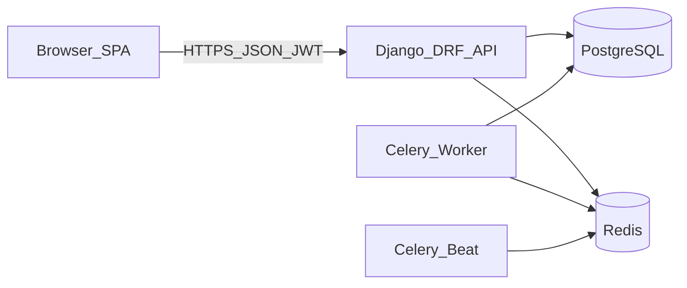
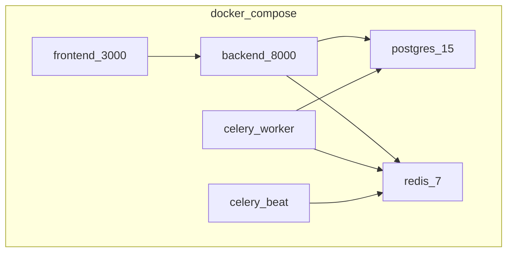
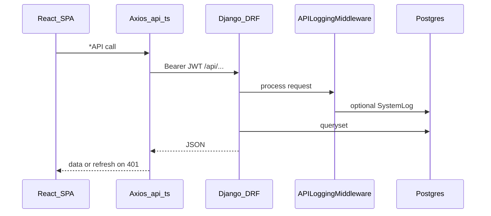
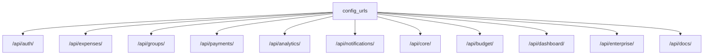
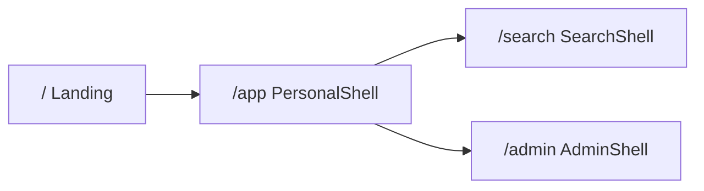

# Architecture

LedgerCore is a **monolith**: one Django REST API and one React SPA. There is no separate API gateway, mobile client, or WebSocket server in this repository.

## System context

| Component | Path / notes |
|-----------|----------------|
| SPA | `frontend/` — React 18, MUI, Redux, Axios |
| API | `backend/` — Django 4.2, DRF, SimpleJWT |
| DB | Postgres via `DATABASE_URL` (SQLite fallback for local) |
| Jobs | Celery + Redis — `backend/config/celery.py` |

See [feature-status.md](feature-status.md) for what is fully wired vs stubbed.

## Docker Compose

From [`docker-compose.yml`](../docker-compose.yml):

Local without Docker: `python setup_dev.py` then `.\start.ps1` — see [getting-started.md](getting-started.md).

## Request path

Auth refresh details: [flows.md](flows.md).

## Backend apps → API prefixes

Registered in [`backend/config/urls.py`](../backend/config/urls.py):

| App (`backend/apps/`) | Responsibility |
|----------------------|----------------|
| `authentication` | Users, JWT, TOTP / app-lock |
| `expenses` | Expenses, shares, recurring, offline sync |
| `groups` | Groups (UI: Squads), memberships, invites |
| `payments` | Settlements, balances, payment requests |
| `budget` | Envelopes, monthly budgets, fixed costs, goals |
| `analytics` | Trends, post-game, insights |
| `notifications` | In-app notifications |
| `enterprise` | Entities, audit events, export jobs |
| `core` | Currency, categories, SystemLog, home dashboard |

## Frontend zones (summary)

Full route map: [frontend.md](frontend.md). Glossary: [glossary.md](glossary.md).
