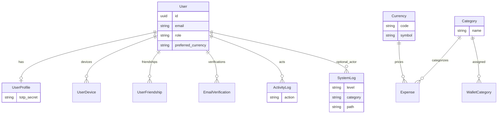
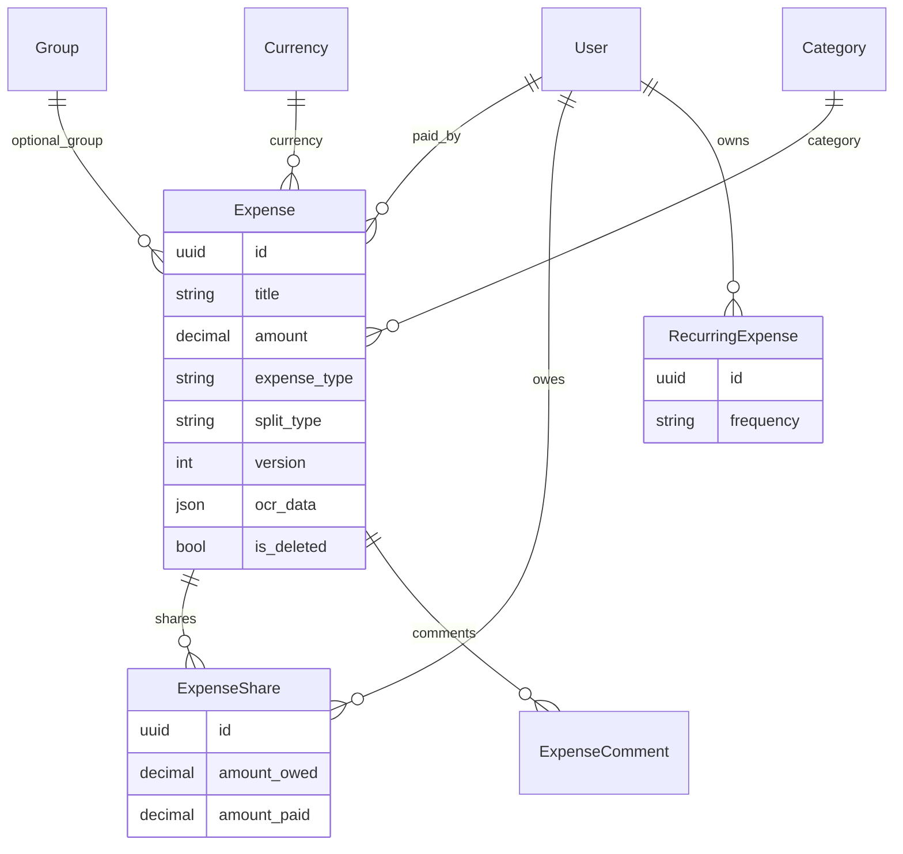
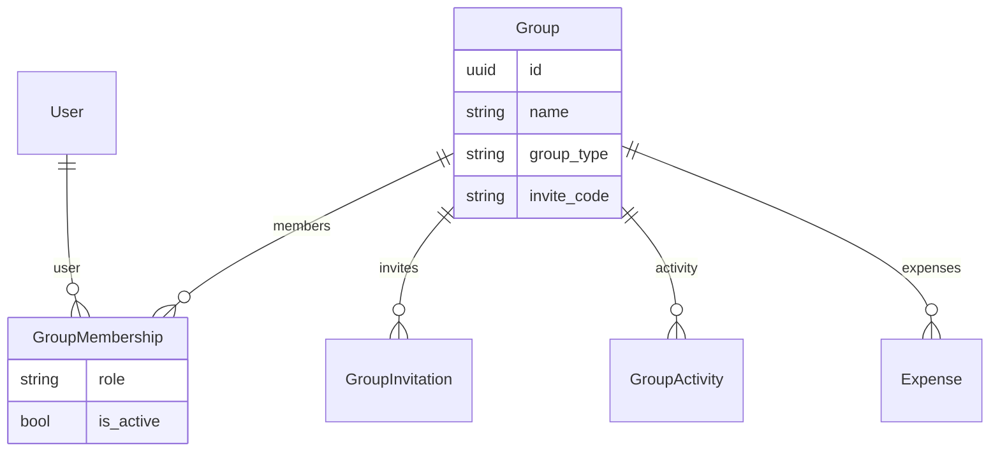
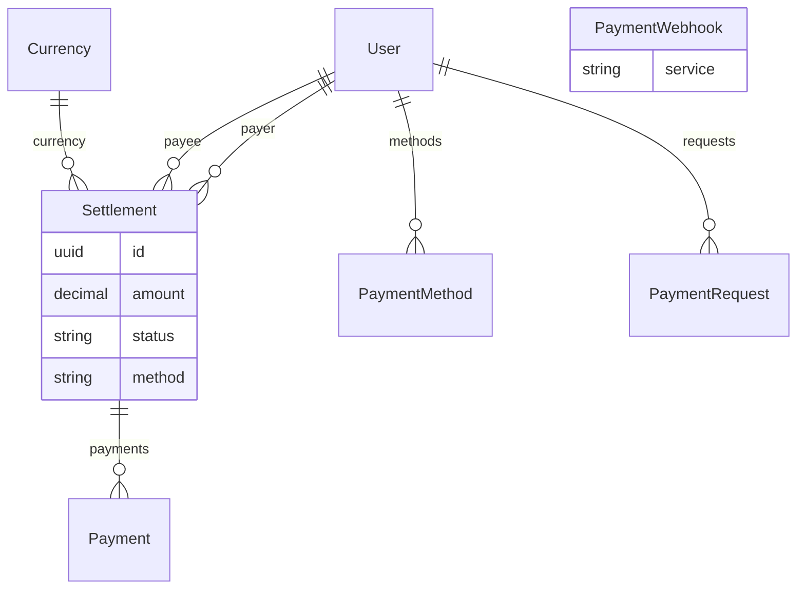
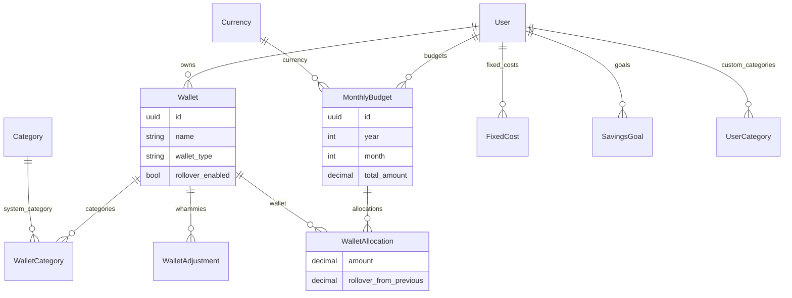
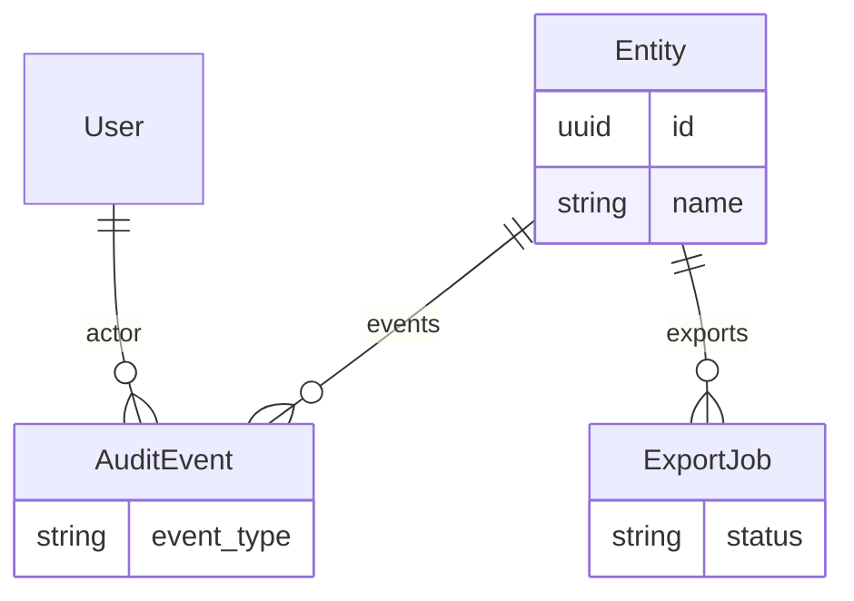

# Data model

PostgreSQL (or SQLite locally). Most domain entities use **UUID** PKs and **timestamps** via `UUIDModel` / `TimeStampedModel` in [`backend/apps/core/models.py`](../backend/apps/core/models.py).

Models live under `backend/apps/*/models.py`. Terms: [glossary.md](glossary.md).

## Auth and core

- **SystemLog** — HTTP/API observability (`APILoggingMiddleware`), admin UI `/admin/logs`
- **ActivityLog** — domain activity trail (separate from SystemLog)

## Expenses

`version` powers offline sync — see [flows.md](flows.md) and [feature-status.md](feature-status.md).

## Groups (UI: Squads)

## Payments and settlements

Debt simplification logic: `backend/apps/payments/debt_simplifier.py` (not a table).

## Budget envelopes

## Enterprise

## Analytics and notifications (summary)

- **Analytics:** `ExpenseAnalytics`, `UserSpendingPattern`, `ReportTemplate`, `GeneratedReport`
- **Notifications:** `Notification`, `NotificationPreference`, `NotificationTemplate`, `NotificationLog`

Post-game aggregates are mostly computed in services/views, not only stored rows — see `/api/analytics/post-game/`.
