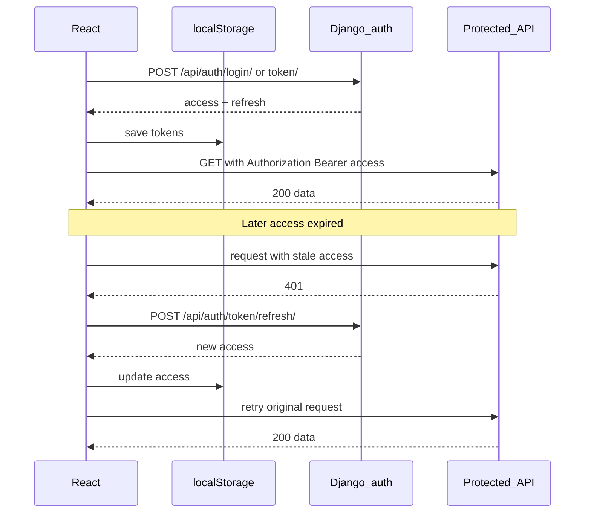
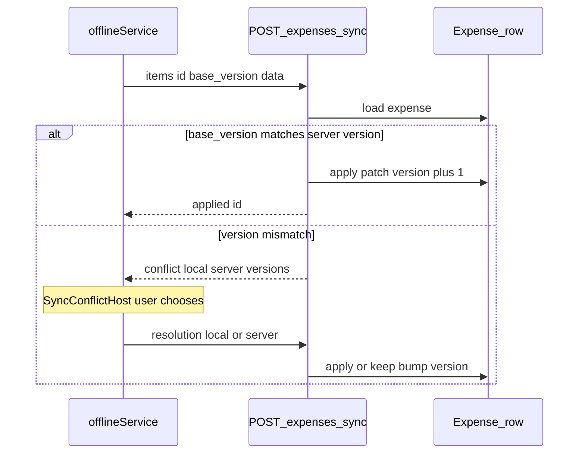
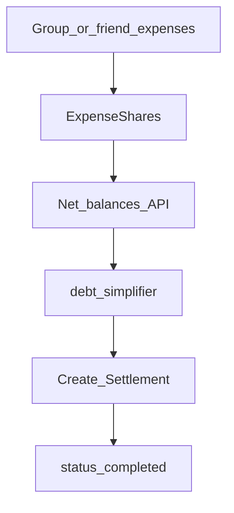
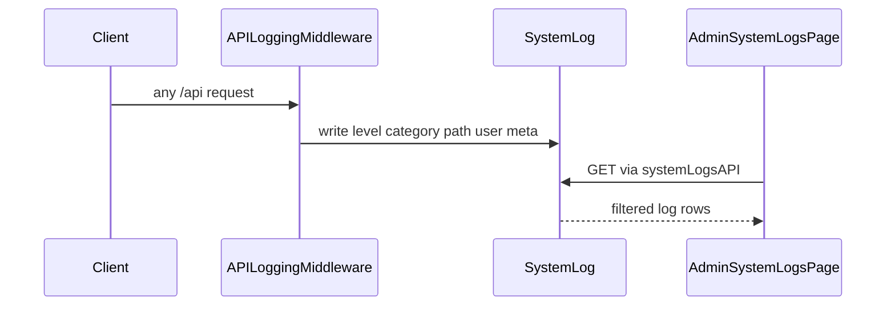

# Key flows

Sequence diagrams for the behaviors that are easy to misunderstand. Code paths are linked under each diagram.

## 1. JWT login and refresh

Implementation: `frontend/src/services/authSession.ts`, `frontend/src/services/api.ts` interceptors, `backend/apps/authentication/`.

If refresh fails → session expired handler clears tokens (no blind full reload loop).

## 2. Offline expense sync and conflicts

- Backend: `backend/apps/expenses/sync_views.py`
- Frontend: `frontend/src/services/offlineService.ts`, `SyncConflictHost.tsx`
- Field: `Expense.version`

## 3. Settlements and balances (high level)

- Models: `payments.Settlement`, related payment/request models
- Logic: `backend/apps/payments/debt_simplifier.py`
- UI: `/app/settlements`

Gateway charge flows (Stripe/PayPal SDK) are **not** fully live — see [feature-status.md](feature-status.md).

## 4. Request logging → SystemLog → admin UI

- Middleware: `backend/apps/core/middleware.py`
- Model: `core.SystemLog`
- UI: `/admin/logs` → `AdminSystemLogsPage.tsx`

`ActivityLog` is a separate domain activity model — not the same as SystemLog ([glossary.md](glossary.md)).
