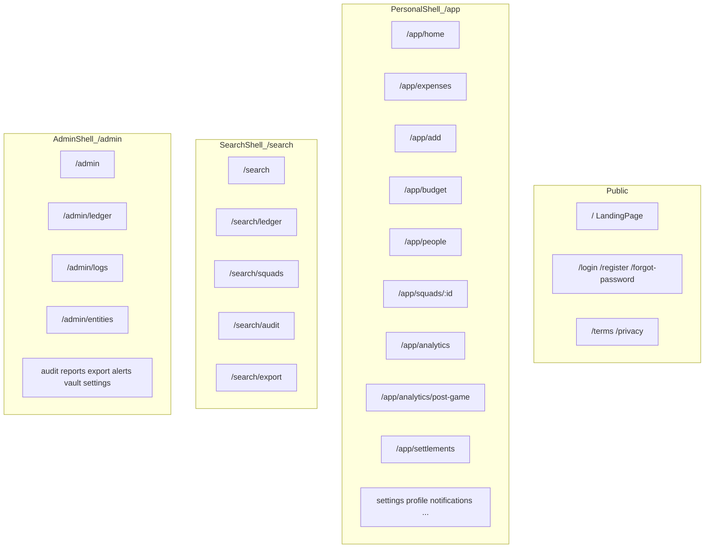
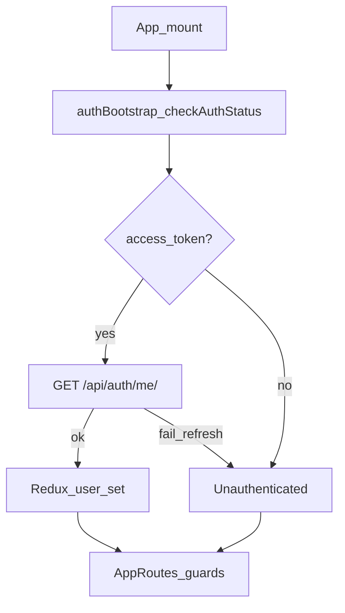
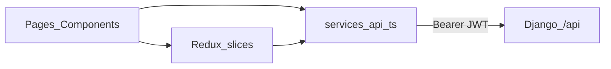

# Frontend

UI brand: **LedgerCore**. Stack: React 18, TypeScript, MUI v5, Redux Toolkit, React Router, Axios.

Source of routes: [`frontend/src/routes/AppRoutes.tsx`](../frontend/src/routes/AppRoutes.tsx).

## Three shells

| Zone | Shell | Guard | Who |
|------|-------|-------|-----|
| `/app/*` | `PersonalShell` | `AuthGuard` | Signed-in users |
| `/search/*` | `SearchShell` | `AuthGuard` | Signed-in users |
| `/admin/*` | `AdminShell` | `AuthGuard` + `AdminGuard` | `admin` / `enterprise_admin` |
| `/` auth pages | — | `PublicGuard` | Guests |

Legacy paths (`/dashboard`, `/expenses`, …) redirect into `/app/*`.

**Squad** in the UI is a **Group** in the API — see [glossary.md](glossary.md).

## Auth bootstrap

- Tokens: `frontend/src/utils/storage.ts`
- Refresh on 401: `frontend/src/services/authSession.ts` (no full-page reload)
- Admin gate: `frontend/src/utils/roles.ts` → `canAccessAdminZone()`

## State and API client

Named clients in `frontend/src/services/api.ts`: `authAPI`, `expensesAPI`, `groupsAPI`, `budgetAPI`, `settlementsAPI`, `analyticsAPI`, `enterpriseAPI`, `syncAPI`, `systemLogsAPI`, …

## Themes

| Surface | Tokens |
|---------|--------|
| App (dark) | `frontend/src/theme/ledgerCoreTheme.ts` |
| Landing | `frontend/src/pages/landing/landingTokens.ts` |
| Layout | `frontend/src/layout/constants.ts` |

## Layout building blocks

`PersonalShell`, `SearchShell`, `AdminShell`, `PageShell`, `AppTopBar`, `DesktopShellLayout`, `BottomNav` under `frontend/src/layout/`.
